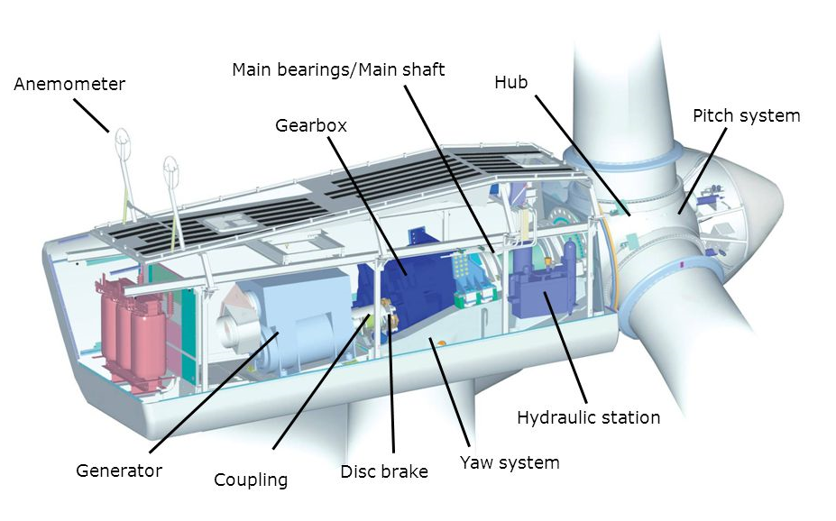
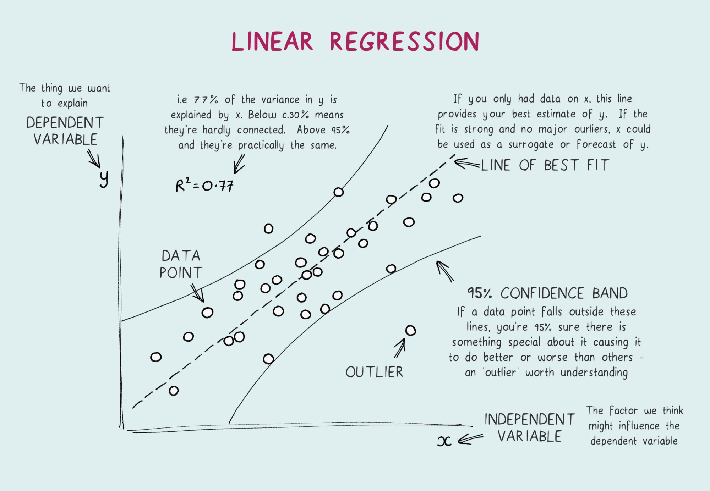
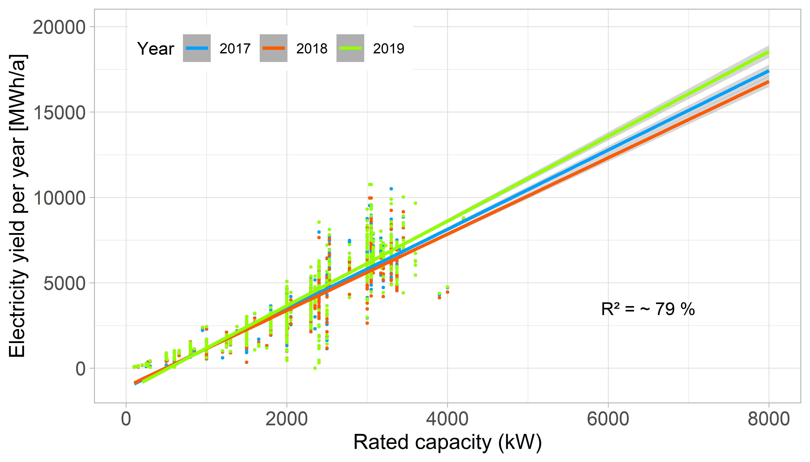

---
#
# Required Information --------------------------------------------------------
# change lines 5 - 15
title: "Wind Energy and Repowering Potential in Rhineland-Palatinate from 2021 to 2030"
type: "Master's Thesis"
author: "Elias Cuadra Braatz"
matriculation_number: "219202265"
date: "`r format(Sys.time(), '%B %d, %Y')`"
university: "Universität Koblenz - Landau"
institute: "Institute of Environmental Sciences" 
chair: "Environmental Economics"
chair2: "Chair: Prof. Oliver Frör"
advisor1: "Dr. Stefan Jergentz"
advisor2: "Dr. Nanki Sidhu"            
program: "Master of Environmental Sciences"
#
abstract: |  
  `r if(knitr:::is_latex_output()) paste(readLines("prelim/00-abstract.Rmd"), collapse = '\n  ')`
acknowledge: |  
  `r if(knitr:::is_latex_output()) paste(readLines("prelim/00-acknowledge.Rmd"), collapse = '\n  ')`
abbreviations: |  
  `r if(knitr:::is_latex_output()) paste(readLines("prelim/00-abbreviations.Rmd"), collapse = '\n  ')`
toc: true                              # table of contents
toc_depth: 3
lot: true                              # list of tables
lof: true                              # list of figures
link-citations: TRUE
bibliography: bib/repowering_final.bib       # bibliography file
csl: csl/abhandlungen-aus-dem-mathematischen-seminar-der-universitat-hamburg.csl
#
# Rendering Options -----------------------------------------------------------
#
knit: "bookdown::render_book"
output: 
  huwiwidown::thesis_pdf
space_between_paragraphs: true       # if you want spaces bt paragraph
# header-includes:     # if including additional latex packages or commands
  # - \setlength{\parindent}{17pt}
---


```{r include_packages, include = FALSE}
# This chunk ensures that the `huwiwidown` package is installed and loaded. This
# package includes the template files for the thesis.
if (!require(devtools)) {
  install.packages("devtools", repos = "http://cran.rstudio.com")
}
if (!require(huwiwidown)) {
  devtools::install_github("phister/huwiwidown")
  library(huwiwidown)
}
```


<!--chapter:end:index.Rmd-->

# Introduction

This thesis was done and written in scientific recognition of the effects of climate change as reported by the Intergovernmental Panel on Climate Change (IPCC) and the  the importance of reducing greenhouse gas emissions to prevent a rising of the global average annual temperature below 2 $^\circ$C  @IntergovernmentalPanelonClimateChange.2014. To achieve this goal many countries around the globe put special effort in greenhouse gas reduction and the transformation of their industry. For the fulfillment of this purpose the Federal Climate Protection Act was passed in 2019 with latest changes in 2021 and states that the greenhouse gas reduction in comparison to the year 1990 should be at least 65 % (former 55 %) in 2030 and at least 88 % in 2040 and from 2045 onward there should be a net greenhouse gas neutrality @BundesamtfurJustiz.2019. The tightening of these reduction targets came through the recent decision and the subsequent press release No. 31 from April 29, 2021 @Bundesverfassungsgericht.24.03.2021 of the first Senate of the Federal Constitutional Court which states that the regulations of 2019 on the national climate protection targets and the annual emission quantities permitted up to 2030 are incompatible with fundamental rights, as there are not sufficient criteria for further emission reductions from 2031 onward. It is stated that the legal requirements are not sufficient to bring about a timely transition to climate neutrality. The German legislature has therefore published the adjusted edition of this act that strives for a faster development of renewable energies and the energy transition in general @BundesministeriumfurUmweltNaturschutzundnukleareSicherheit.12.05.2021. The central control instrument for the expansion of renewable energies is an will remain the Renewable Energy Act (EEG) with its latest edition of 2021. The aim of the EEG is to rebuild the energy supply and to increase the share of renewable energies in the electricity supply to at least 65 % by 2030 and that all the electricity consumed and generated in Germany will be greenhouse gas neutral by 2050 @BundesamtfurJustiz.2021. The tools of the EEG are fixed feed-in tariffs for young technologies such as wind and solar energy to enter the market and guaranteed purchase and priority feed-in of electricity. From 2017, the level of remuneration for renewable electricity will not be set by the state, as was previously the case, but will be determined through tenders on the market to create a free market economy.

Similarly to the Federal law there is the State Climate Protection Act (Landesklimaschutzgesetz - LKSG) of Rhineland-Palatinate (RLP) that came into force on August 23, 2014 states that the total of all greenhouse gas emissions in RLP have to be reduced by at least 40% by 2020 compared to the base year 1990. Further the aim is to reduce greenhouse gas emissions by 100 % by 2050, but at least by 90% @RheinlandPfalz.19.08.2014. Likewise the coalition agreement from 2021 to 2026 of the current government of RLP desires the goal of “100% renewable energies by 2030” and it can be assumed that the Climate Protection Act will be amended @SPDGruneFDP.2021. This shows that this study is still very topical on a state level and also highly embedded in a dynamic socio-economic context.

Whether on a global, national or a local scale it is clear that a cornerstone of the transition of our society to a ecological sustainable form is the change of our fossil fuel based economy to a economy that is powered by renewable energies. Thus, the energy transition is regarded as the main focus of the strategy to climate neutrality and RLP wants to play a pioneering role in the implementation of the energy transition . In addition to energy from the sun, water and biomass, two thirds of the electricity generated in 2030 should come from wind power and is therefore the subject of the research presented in this master thesis @LandesregierungRheinlandPfalz.2021. This study was carried out on behalf of the state-owned Energy Agency of Rhineland-Palatinate @EnergieagenturRheinlandPfalz.2021 within the project "Municipal Greenhouse Gas Accounting and Regional Climate Protection Portals in Rhineland-Palatinate" @KomBiReK.2021, which is funded by the European Regional Development Fund @EuropeanRegionalDevelopmentFund.2021 and the state of RLP. This project supports the creation of municipal climate protection measures in order to mitigate CO\textsubscript{2} emissions and achieve the climate protection goals of the municipalities and the state and thereby increases regional added value, ensures sustainability and thus improves the quality of life of all citizens. 

As of 2017, the gross electricity generation in RLP from wind power was 5.9 TWh, which was 29% of the total 20.7 TWh of electricity generated in the state @Lehnert.2020. By 2019, the electricity generated from wind turbines (WTs) has already increased to more than 6.7 TWh @AmprionGmbH.2019. It can be assumed that, on the one hand, electricity consumption will increase in the future due to the electrification of transport and domestic heating, and on the other hand, efficiency measures can also lead to a lower energy consumption. Whereas, some past studies and scenarios estimated a slight increase and others a slight decrease but on average a relatively unchanged electricity consumption in Germany, which is currently about 560 TWh @NormanGerhardt.2015, the newest press release of the Federal Ministry for Economic Affairs and Energy makes it very clear. An increase to a previous prediction of about 12% from 580 to 655 TWh is expected @AndreasMertens.13.07.2021, and further studies will follow in the autumn of 2021. If RLP wants to become independent of electricity imports and achieve the self-set goals of covering two thirds of the electricity consumption from wind power with an estimated electricity demand of 33 TWh in 2030, electricity supply from WTs must be about 22 TWh per year. There are two ways of increasing the amount of electricity generated by wind energy. Either areas can be used that have already been identified as suitable for WTs but have not yet been built on, or else, existing old systems whose absolute electricity feed-in quantity is low, can be replaced by new, taller and more efficient systems through so-called "repowering".

The aim of this work is to develop a method for calculating the wind energy potential and its related area consumption at a state level regarding the two described options. The objective is then to evaluate the desired expansion and emission reduction targets up to 2030 and assess weather they are realistic and in line with the current distance rules and approval procedures and give recommendations for policy makers. Accordingly, the central questions of this work are:

1.	How much electricity per area can be generated by a new WT from 2021 until 2030 in RLP?

2.	What is the potential when all wind turbines built before 2005 are repowered?

3.	How much area is needed to generate the target amount of 22 TWh?

In order to answer these questions the data analysis and results of the master and movement data provided by the transmission system operator Amprion and of the market master data register (MaStR) is Presented in chapter 3 and 4. The gained results are discussed subsequently in chapter 5 and the paper ends with a summary of the main findings and a recommendation to policy makers in the concluding chapter number 6. To introduce the reader with all the necessary background information on the topic, the scientific and technical fundamentals, that are a prerequisite to this thesis and the assessment of the electricity yield from onshore WTs in RLP, are explained in the following chapter number 2.   

\newpage


<!--chapter:end:sections/01-intro.Rmd-->

# State of the art

## Greenhouse gas emissions

First of all, the problem of greenhouse gas emissions will be stated briefly as the bases and motivation of this thesis. It is getting warmer, as Ed Hawkins a climate scientist from the University of Reading impressively visualizes with his warming stripes using the World Meteorological Organization (WMO) annual global temperature data set (figure \@ref(fig:wmo)). The color of each stripe, in which blue indicates cooler and red warmer temperature, represents the anomaly to the average annual temperature in the period of 1971 - 2000. 

(ref:hawkins) Warming stripes for 1850-2018 using the WMO annual global temperature data set @EdHawkins.2018.

```{r wmo, echo=FALSE, fig.cap="(ref:hawkins)", out.width = "100%", out.height="7%"}
knitr::include_graphics("figures/wmo_stripes.png")
```

The debate about the significance of global warming and climate change is already omnipresent in social media, newspapers, politics, economics and science, as well as the society as a whole, and its relevance is still growing. The Intergovernmental Panel on Climate Change (IPCC) has brought virtually unequivocal evidence that the increase of average global temperature is related to anthropogenic greenhouse gas (GHG) concentrations
@IntergovernmentalPanelonClimateChange.2014. The major international project to encounter climate change and adapt to its effects is the Paris Agreement, whose central aim is to minimize the threat of climate
change by keeping the global temperature increase well below 2 $^\circ$C preferably below 1.5 $^\circ$C of the pre-industrial level @UnitedNations.2015. The Paris Agreement requires all 196 participating countries to proclaim their according efforts through Nationally Determined Contributions (NDCs). After missing several targets, Germany passed the Climate Protection Law in December 2019. The climate protection targets for 2030 are set to reduce GHG emissions by at least 55% compared to 1990. The law also formulates the goal of GHG neutrality by 2050. The biggest GHG emitter in Germany is the energy industry @Umweltbundesamt.2018. Consequently, to reduce its GHG emissions in the energy sector and to support the development of renewable energy power plants, Germany implemented the Renewable Energy Sources Act in 2000 with latest editions from 2017 and 2021. This law intends to support the expansion of renewable energies with the aim of 65% of electricity from renewable sources in 2030. This should be done by regulating the preferred feed-in of electricity from renewable energy sources (RES), mainly wind and sun, into the power grid as well as ensuring fixed feed-in tariffs (FIT) for a period of 20 years to ensure the fast expansion of renewable energy power plants and therefore reduce GHG emission and limit global warming @BundesamtfurJustiz.2021. 


## Region of interest

Secondly, the region of interest (ROI) in this case Rhineland-Palatinate in south-west Germany is presented for it is important to know the site conditions and the statistical parameters of the past to assess the wind energy potential for future years. RLP has diverse geographic structures such as many low mountain ranges and forests namely the Rhenish Slate Mountains, Hunsrück, Eifel, Taunus, Westerwald, North Palatinate Uplands and further south the Palatinate Forest but also plain areas such as the Upper Rhine Plain, Mainz Basin and West Palatinate moorlands to only name a few. It borders North Rhine-Westphalia in the north, Hesse and Baden-Wuerttemberg in the east, the French region of Grand Est and Saarland in the south, and Luxembourg and the province of Liège in the Belgian region of Wallonia in the west. Rhineland-Palatinate is the federal state with the largest area on the left bank of the river Rhine. The climate in Rhineland-Palatinate is characterized by a moderate, humid climate with warm summers and mild to cool winters which makes it a typical Western European climate. The average annual temperature is 10.4 $^\circ$C which is 1.8 $^\circ$C above the long-term average. Settlement areas occupy around 8,6 % and transport infrastructure around 6.1 % of the area @StateStatisticalOfficeofRhinelandPalatinate.2020. Rhineland-Palatinate is one of the most densely forested countries in Germany, as the forests here cover around 42 percent of the country's area @HansenandLamour.2021.

Especially the electricity generation and data from existing WTs is important but also information about different types of land cover and the occurrence of wind  are crucial for this work. An overview of important parameters regarding the estimation of the wind energy potential up to the year 2030 are shown in table \@ref(tab:table0). The study area and the modeled wind speeds taken from the Windatlas RLP @MinisteriumfurWirtschaftKlimaschutzEnergieundLandesplanung.2013 are seen in figure \@ref(fig:wind).

(ref:stats)  @StateStatisticalOfficeofRhinelandPalatinate.2020 

```{r table0, echo=FALSE}
col_names <- c(
  "", ""
)
row1     <- c(
  "Area", "19,858 km²"
)
row2     <- c(
  "Agricultural area", "8,110 km²"
)
row3     <- c(
  "Forest area", "8,060 km²"
)
row4     <- c(
  "Settlement and traffic areas", "2,901 km²"
)
row5     <- c(
  "Inhabitants", "4.1 mm"
)
row6     <- c(
  "Electricity demand 2021", "30 TWh"
)
row7     <- c(
  "Electricity demand 2030", "33 TWh"
)
row8     <- c(
  "Electricity generation 2017", "20.7 TWh"
)
row9     <- c(
  "Electricity generation from WTs 2019", "6.78 TWh"
)
row10     <- c(
  "Required generation from WTs in 2030", "22 TWh"
)
row11     <- c(
  "Total number of WTs", "1,702"
)
df <- matrix(data = c(row1, row2, row3, row4, row5, row6, row7, 
                      row8, row9, row10, row11), nrow = 11, byrow = T)
colnames(df) <- col_names
df <- data.frame(df)
knitr::kable(
  df,
  booktabs = TRUE,
  caption = "Important information of Rhineland-Palatinate regarding the assessment of the wind energy potential up to 2030 (ref:stats) (rounded)",
  col.names = NULL, 
  escape = FALSE
) %>%
kable_styling(latex_options = c("HOLD_position")) %>%
row_spec(1:11, hline_after = T, bold = T) %>%
add_header_above(header = "Basic information on Rhineland-Palatinate", bold = T, align = "c") %>% 
column_spec(1, width = "12cm") %>% 
column_spec(2, width = "3cm")
```


(ref:foo) Wind speeds in RLP 140 m above Ground @MinisteriumfurWirtschaftKlimaschutzEnergieundLandesplanung.2013. 


```{r wind, echo=FALSE, fig.cap="(ref:foo)", out.width = "100%", fig.pos="H"}
knitr::include_graphics("figures/wind_140m.pdf")
```

## Onshore wind turbines and repowering

Wind energy has been used by humans for thousands of years, but the generation of electrical power has only been possible since the 19th century with the beginning of industrialization and is now the subject of constant research and development in the context of the energy transition @Wikipedia.2021. A wind turbine usually consists of the three main components: rotor blades, nacelle and tower. In addition to other elements, the nacelle contains: the gearbox, generator, transformer and control system @MladenBosnjakovic.2013. Most commonly WTs have three rotor blades that are attached to the rotor hub and absorb the kinetic energy of the wind and convert it into a rotary motion. If the winds are too strong, the rotor blades can be “taken out of the wind” by adjusting the blade angles through the so-called pitch control, thus protecting the system from damage but also increasing efficiency through optimal speeds. The avoidance of damage through peak loads due to high wind speeds can also be prevented through the stall effect but this requires complex aerodynamic design of the rotor blades. The gearbox changes the speed of the rotary motion and the generator converts the kinetic energy into electricity. However, there are also systems with direct drive and without gear. The nacelle can be rotated to an optimal position when the wind conditions change, and an electromagnetic brake helps to shut down the system when the winds are too strong or during maintenance work.Without going into the details of technical construction, the main components of the nacelle according to Vestas one of the largest manufacturers for WTs is shown in figure \@ref(fig:nacelle). 

```{r nacelle, echo=FALSE, fig.cap="Main components in the nacelle (Vestas)", out.width = "100%", fig.pos="H"}

```

In addition to its load-bearing function, the tower also contains the power lines that conduct electricity to the grid connection of the distribution network @NetzKonstrukteur.16.11.2020. In the first half of 2021, in Germany 240 new WTs with a rated capacity of 971 MW were installed. This corresponds to a 62 % increase if compared to the first six months of the previous year. In the same period 135 WTs with an installed capacity of 140 MW were shut down. The net expansion in the first half of 2021 is consequently 831 MW. The cumulative installed capacity increased by 1.5 % to 55,772 MW as of June 30, 2021. A total of 29,715 onshore WTs are installed in Germany that provide this capacity. To achieve the expansion target for 2022 yet another net addition of around 1.2 GW is required. The target for 2030, which originates from the EEG 2021 is 71,000 MW. This number is not yet adapted by the expected increase in electricity demand in 2030. The development of onshore WTs regarding expansion and dismantling according to Deutsche WindGuard is shown in figure \@ref(fig:winddevelopment). The development of repowering processes are shown in figure \@ref(fig:repowering).

(ref:dwg) Development of expansion and dismantling of WTs in Germany from 1995 until 2021 @DeutscheWindGuard.2021.

```{r winddevelopment, echo=FALSE, fig.cap="(ref:dwg)", out.width = "100%"}

```

The service provider Deutsche WindGuard in the complex energy market stands for independent, manufacturer-neutral advice and comprehensive scientific, technical and operational services. The wide range of services creates extensive synergy effects. Whether due diligence, market analysis, contract advice or feasibility study, the expertise and know-how of the entire WindGuard group flow into all services. Deutsche WindGuard has been compiling the six-monthly expansion statistics since 2012. Via the Bundesverband Windenergie e.V. (BWE) As a member of the Federal Renewable Energy Association (BEE), the BWE represents the entire wind energy industry with its more than 20,000 members. Together, the supplier and manufacturing industry anchored in German mechanical engineering, project planners, specialized lawyers, the financial sector and companies from the fields of logistics, construction, service / maintenance and storage technologies, electricity traders, network operators and energy providers ensure that the BWE is available to all questions relating to wind energy is the first point of contact for politics and business, science and the media.


(ref:dwg2) Development of the annual and proportionally installed and reduced capacity within the scope of repowering projects @DeutscheWindGuard.2021.

```{r repowering, echo=FALSE, fig.cap="(ref:dwg2)", out.width = "100%"}

```

The production of WTs can usually be realized within a few months with relatively little material and energy consumption. After a short period of operation, a WT has already "brought in" the energy that was required for its production. This period is known as the energy returned on energy invested (ERoEI) or shorter energy return on investment (EROI). A wind turbine on land takes between three and seven months for energetic amortization. Offshore systems with a even higher rated capacity need four to five months to recycle the energy used in production and installation. According to this, every operating hour delivers “net” clean electricity - for an average of at least 20 years @PriyanaRazdan.2019. In comparison photovoltaic systems need between one and four years for this energetic amortization. A wind power plant can therefore provide 40 to 70 times more energy during its entire life cycle than was expended for its manufacture, use and disposal, depending on the design. If this amount of electricity replaces fossil fuels, the wind power plant can credit itself with the avoided emissions from coal and gas power plants. Of course not the whole amount but still the CO\textsubscript{2} equivalent of a WT is about 10.6 g/kWh according to Memmler et al. @M.MemmlerDr.T.LaufS.Schneider.2017 and about 400 g/kWh in the Federal electricity mix @Umweltbundesamt.2021. 

The electricity generation from wind energy in RLP can be traced by using data from the transmission system operators.In the case of RLP it is the transmission network operator Amprion, who publishes so-called master and movement data for the amount of electricity fed-in with remuneration for each calendar year in accordance with section 77 of the Renewable Energy Act (EEG)2017 @Bundesgestzblatt.2017. This master and movement data includes information about the annual electricity generation and the EEG system key. The data for RLP is currently available until 2019. The total amount of electricity fed-in with remuneration in 2019 from wind turbines in RLP is 6,782,180,753 kWh, i.e. approximately 6.782 TWh @EnergieagenturRheinlandPfalz.2019. The average electricity output in RLP of one WT was about 7,000 MWh in 2019 but newly commissioned WTs had already a output of more than 10,000 MWh which would be sufficient to cover the demand of 2,500 households (4,000 kWh). But looking at the product brochure of large manufacturers like Vestas, Nordex or Simens Gamesa the development of WTs this is not at the end. The annual generation of electric energy of a Vestas V162 with a nominal output of 5.6 MW, hub height up to 166 m, rotor diameter of 162 m and a swept area of 20,612 m² is shown in figure \@ref(fig:v162). Nordex has a similar model called N163/5.X with a nominal output of 5 MW and more, a hub height of up to 164 m, rotor diameter of 163 m and a swept area of 20,867 m² @Nordex.2021. Practical experience from project developers show that wind parks with a estimated commissioning in 2025 are already planned with the next generation of onshore WT that have over 6 MW nominal power. But even now a product of Simens Gamesa called SG 6.6-170 has a nominal power of up to 6.6 MW, a hub height of up to 165 m, a rotor diameter of 170 m and a swept area of 22,697 m² @SimensGamesa.2021. This means that the expected annual output of WTs in RLP with an average wind speed of 6 m/s can be estimated with relative certainty with 15 to 20 GWh.

(ref:V162) Annual energy production of a V162-5.6 IEC S in relation to the wind speed @VestasWindSystemsAS.2019

```{r v162, echo=FALSE, fig.cap="(ref:V162)", out.width = "80%", fig.pos="H"}
knitr::include_graphics("figures/V162.png")
```

## Spatial planning in RLP

### State level

As the highest planning authority in Rhineland-Palatinate in terms of spatial planning, the Ministry of the Interior and Sport acts and thus ensures a fair balance between the various demands on the use of space as a resource. The state planning thus acts as a neutral mediator and moderator to ensure sustainable development of the state of Rhineland-Palatinate and the requirements of the state government for a social and ecological transformation regarding sustainable economic development, social integrative cohesion and responsibility for the environment reconciled. The state planning controls the comprehensive, regional and interdisciplinary planning for the state @MinisteriumdesInnernundfurSport.2021. The main legal bases of spatial planning in Rhineland-Palatinate are the federal Spatial Planning Act (Raumordnungsgesetz - ROG) and the State Planning Act (Landesplanungsgesetz - LPlG)@BundesministeriumderJustizundfurVerbraucherschutz.2008. The Spatial Planning Act primarily contains the basics of the procedure for drawing up state-wide and regional spatial plans, the legal effects of the plan content, and the procedure for examining projects that are of spatial importance. The State Planning Law only has a supplementary function compared to the Spatial Planning Act. It regulates in detail the preparation of spatial plans, the implementation of spatial planning procedures and the organization of regional planning in Rhineland-Palatinate. An amendment to the State Planning Law recently made it possible for recognized nature conservation associations to be accepted as members of the regional planning communities @MinisteriumderJustizRheinlandPfalz.2003. 

The latest State Development Program is number IV (Landesentwicklungsprogramm IV) from 2008 with several updates forms the coordinating and interdisciplinary spatial framework for the development of the state of Rhineland-Palatinate and specifies goals for the development of the infrastructure @MinisteriumdesInnernundfurSport.2008. Regarding wind power, the first partial update of the State Development Program IV stipulated that an orderly expansion of wind power should be ensured through regional and urban land use planning. For this purpose, the regional plans should identify priority areas for the use of wind energy, the authority for a final control through the designation of concentration areas for wind energy was transferred to the land-use planning. The basic distribution of tasks between state planning, regional planning and land-use planning is retained in the third partial update of the State Development Program IV from 2017 @MinisteriumdesInnernundfurSport.2017. In order to ensure an appropriate balance between the expansion of wind energy on the one hand and the requirements of nature, landscape and cultural landscape protection as well as the needs of the population on the other hand, adjustments through an immediately applicable change are beeing made in the partial update of the State Development Program IV. The main innovations at a glance are:

**The following exclusion criteria for WTs apply:**

- In nature reserves
- In the Palatinate Forest Nature Park
- In national parks
- In the core zones of nature parks
- In the core zones and in the framework areas of the UNESCO World Heritage Areas Upper Middle Rhine Valley and Upper Germanic-Raetian Limes
- In nationally significant historical cultural landscapes of assessment levels 1 and 2
- In those Natura 2000 areas for which the state bird sanctuary for Hesse, Rhineland-Palatinate and Saarland and the State Office for the Environment, Water Management and Trade Supervision in the “nature conservation framework for the expansion of wind energy in Rhineland-Palatinate” have identified a very high potential for conflict
- In water protection areas of zone I
- In areas with contiguous hardwood stands over 120 years old

**Modification of area specifications**. The requirement to provide two percent of the land area for the use of wind energy (Principle G 163 a) is retained in principle, but the formulation as a minimum proportion is dispensed with (deletion of the term “at least”). The same applies to the provision of forest areas (principle G 163 c).

**Minimum area size: systems in a spatial network**. The requirement that wind turbines may only be erected at locations where it is possible to build at least three systems in a network is becoming a legally binding goal (previously G 163 f, now Z 163 g). In the case of repowering, it is sufficient to erect at least two turbines.

**Minimum distance to areas with residential use**. Required minimum distance from wind turbines of 1,000 meters to pure, general and special residential areas as well as to village, mixed and core areas, for systems with a total height of more than 200 meters at least 1,100 meters (Z 163 h). Falling short of the distances is only permitted in the case of the particularly desired repowering of old systems (Z 163 i) @MinisteriumdesInnernundfurSport.2017.

In summary, it can be said that efforts are being made to give substantial space to the expansion of wind energy with the 2 % target and special support for the repowering of old systems.

### Regional level
Regional planning agencies are the planning communities for the regions Middle Rhine-Westerwald, Trier, Rheinhessen-Nahe, West Palatinate and the Association Region Rhine-Neckar for the metropolitan region Rhine-Neckar (section 12-15 State Planning Act Rhineland-Palatinate (LPlG)). The planning communities are made up of the independent cities and districts in the area of a region. In Rhineland-Palatinate, there are regional spatial plans in four planning regions and one transnational metropolitan region. These are currently being updated taking into account the content of State Development Program IV and are thus adapted to the current regulatory situation and are used to concretise the given specifications for the respective planning region.

### Local level
According to Section 5 of the Building Code (BauGB), the land use plan for the entire municipal area must outline the type of land use resulting from the intended urban development according to the foreseeable needs of the municipality @BundesministeriumderJustizundfurVerbraucherschutz.1960. It is a graphic plan representation of the entire municipal area, in which the existing land uses and those desired for the future are shown. For example, residential areas, commercial areas and arable land are displayed. This applies to areas on which these uses already exist and areas on which this use is to be established in the future. The purpose of the zoning plan is not a cartographic representation of the current situation, but rather a conceptual development plan directed towards the future. Therefore, the planning representations deviating from the actual state represent the essential content of the zoning plan, although usually occupy a much smaller area than the existing representations.

The zoning plan is therefore of particular importance for the designation of new building areas or concentration zones for wind power plants according to Section 5 (2b) of the BauGB. Positive location assignments at one or more places in the area of the administrative community mean that the remaining planning space is kept free of wind turbines and a uniform landscape is maintained, because according to Section 35 (5), a wind turbine is generally to be given preferential approval if public interests do not conflict and adequate development is assured. The exact land-use planning in a municipality is then regulated by the so-called development plan. It contains the legally binding stipulations for the urban planning order of part of a municipality and forms the basis for further measures required to implement the building code (Section 8 (1) BauGB) @BundesministeriumderJustizundfurVerbraucherschutz.1960.

### Approval 
The approval of wind turbines takes place in the approval process according to the Federal Immission Control Act (Bundesimmissionsschutzgesetz - BImSchG). This is always necessary for wind turbines over 50 meters in total height. This will ensure that no harmful environmental effects or other dangers can be caused by the planned project and the project does not conflict with any other public law concerns. If this is guaranteed, the applicant has a legal right to be granted the permit (section 6 BImSchG). The district administrations or the city administrations are responsible for issuing the immission control permit.The immission control approval procedure has a concentration effect (section 13 BImSchG). This means that the other permits and approvals required for the operation of the system are also checked and approved as part of the immission control procedure. When approving wind turbines, in addition to the issue of immission control, the focus is particularly on the provisions of nature and species protection law, building regulations and building planning law. In addition, other technical issues such as aviation law or landscape and monument protection can be relevant. The technical assessment with regard to noise, shadows, operational safety and occupational safety is carried out by the structure and approval departments (Struktur- und Genehmigungsdirektion - SGD) @FachagenturWindenergieanLand.2021. 


## Energy policy program
In the newly formed coalition agreement of the government of the federal state of Rhineland-Palatinate from 2021-2026, the goal of 100 % renewable energies in the electricity mix by 2030 is reaffirmed and said: [...] "We will vigorously expand wind power and solar energy in order to double the installed capacity for wind power (...) by 2030." . ”This means the net expansion of 500 megawatts of photovoltaics and **500 megawatts of wind power per year**. In addition, the goal of 100 % renewable energies in the electricity mix should be anchored in the Climate Protection Act. It is further stated that:
"We want to abandon the rigid concentration offer in State Development Plan IV (Z163g), but continue to strive to establish larger wind farms with several systems. With repowering, the sum of the output of the new systems must at least reach the sum of the output value of the old systems to be replaced, or better. This enables a reduction in the number of systems at a location, possibly also in the form of a single system. We want to continue to work with fixed distance rules for new systems and when repowering existing systems. In the future, a minimum distance of 900 meters should apply to new systems. When it comes to repowering, we work with a 20% reduction in the distance. In this way, we want to avoid having to give up accepted locations. In the future, the distance should be measured from the center of the mast base. We adhere to the regulation in the State Development Plan IV (Z.163h) that the minimum distance to pure, general and special residential areas, village, mixed and core areas must be observed. The rule-exception principle applies to us for wind turbines in the core zones of nature parks. The core zones are generally excluded for wind turbines. A case-by-case examination should be possible where the protection goal is not significantly disrupted. Our medium-term goal within this legislative period is to review the nature conservation core zones and to adapt the associated ordinance. We want to check whether we can generally go the way of a liberation in the case of pre-polluted areas (railway lines, motorways, conversion areas) in the area of nature parks" @SPD.2021.

## Climate protection concept RLP
The concept sets out the initial situation (greenhouse gas emissions balance) as well as the options for action and names almost 100 measures from eight fields of action in a catalog of measures with which the country's climate protection goals are to be achieved @MinisteriumfurUmweltEnergieErnahrungundForsten.2020b.

**Catalog of measures**: In order to implement the state's climate protection and energy goals of 100 % renewable electricity generation by 2030 (most recently confirmed by the state parliament resolution of April 26, 2018) with special respect to the transport and heating sector, further expansion of the use of wind energy is essential. According to the previous expansion forecast for wind energy in Rhineland-Palatinate - and if the corresponding regulatory framework conditions are created by the federal government - a total of **2,500 plants with a total output of 8,900 MW** and a contribution to renewable electricity generation of 18.7 GWh will be expected in 2030. The expansion of wind energy has declined sharply in the last two to three years. The reasons for this are diverse and relate to deficits in the EEG 2017. Increasing complexity and duration for the planning of new construction projects, as well as approval hurdles and increasing protests in many places lead to litigation. In order to remove existing obstacles and to promote the necessary expansion of wind energy use, in particular repowering projects, whereby several old systems are replaced by a few more powerful systems, the state will advocate the further development of state-wide and nationwide framework conditions. Concrete measures for this are:

- Facilitation of repowering projects in the existing legal framework especially the Federal Immission Control Act (Bundesimmissionsschutzgesetz - BImSchG). Repowering results in a reduction in the number of installed wind turbines in one location and thus a reduction in imissions when the output is increased. The dismantling of obstacles to approval in the case of new planning and repowering should also be taken into account.
For this purpose, the following measures are to be implemented in accordance with the resolution of the heads of government of the federal states of June 17, 2020: 

1. Needs-based personnel and technical equipment of the planning and approval authorities
2. Approval structures as central as possible per country 
3. Shortening of instances (the higher administrative courts are to decide in the first instance on disputes in the approval procedure)
4. Elimination of the automatically suspensive effect of objections and lawsuits against approvals
5. Establishment of a central advice center 
6. Conservation-related standardization to simplify the enforcement of species protection law when a permit is issued

- Commitment of the state for a continuous further development of the Renewable Energy Act, especially in relation to the compensation of the location-related disadvantages of wind energy locations in countries remote from the coast. Preservation of the diversity of actors and simplification of models for self-supply and direct supply through EEG surcharge relief if no EEG remuneration is used, as well as the implementation of the European Renewable Energy Sources Directive (REDII) in German law.

- Development of framework conditions, information and advice with regard to new business models, such as Power Purchase Agreements (PPA), longer-term electricity supply contracts between system operators and electricity consumers (e.g. industry or energy supply companies), in particular as an option for the continued operation of wind turbines with ending EEG remuneration and as an alternative business model for EEG remuneration for new systems. It is also important to adapt the EEG to abolish the EEG surcharge on self-supply and direct supply with wind energy electricity (not EEG-remunerated) by the federal government.
@MinisteriumfurUmweltEnergieErnahrungundForsten.2020

## Physical basics

The amount of electricity generated by a wind turbine -the electricity yield- can be derived from the physical relationship between the kinetic energy and the power of the wind. Without claiming to be exhaustive, the following applies[^1]:


\begin{equation}
E_{kin}\; =\; \frac{1}{2}\;mv^2
\end{equation}

The air throughput (mass flow $\hat{m}$) that flows through the area swept by the rotor blades can be calculated by multiplying the air density, rotor area and wind speed as well as the time interval required with[^2]:

\begin{equation}
\hat{m}\;=\;\rho A vt
\end{equation}

The power $P$ is equal to the energy per unit of time $\hat{E}$. This results in the power of the wind with[^3]:

\begin{equation}
P_{wind}\;=\;\hat{E}\;=\;\frac{1}{2}\;\hat{m}v^2\;=\;\frac{1}{2}\; \rho \pi r^2 v^3
\end{equation}

(Mac Kay @DavidJCMacKay.2009 and BWE @BWE.2021)

In Formula 3 it becomes clear that the wind speed is the determining factor for the performance of a WT. Because WTs are built to perform at lower wind speeds, most of the time they are not able to operate at very high wind speeds and have to be taken out of the wind at a certain speed to avoid fatigue and destruction through peak loads. A typical load profile of a WT is shown in figure \@ref(fig:powerofwind). If the density of air is 1.3 kg/ m³ and there is an average windspeed of 6 m/s, which could be realistic for many sites in RLP at 140 m above ground, as seen in figure \@ref(fig:wind), then the typical power of the wind per square meter of rotor area is[^4]:

\begin{equation}
\frac{1}{2}\; \rho v^3\;=\;\frac{1}{2}\;1.3 kg/m^3\; *\; (6 m/s)^3\;=\;140\; W/m^2\;\;\; [1\; \frac{kg\, m^2}{s^3} = 1\; W]
\end{equation}

The curve of power per m\textsuperscript{2} in relation to the wind speed is also shown in figure \@ref(fig:powerofwind). Of course, not all the wind's power can be converted and there are further losses when converting kinetic energy into electrical energy in the generator.

```{r powerofwind, echo=FALSE, fig.cap="Left: Power of the wind per rotor area over wind speed; Right: Typical load profile of a WT.", out.width = "49%", out.height= "25%", fig.show='hold',fig.align='center'}
knitr::include_graphics(c("figures/power2.png", "figures/Typical-wind-power-output-versus-wind-speed_W640.jpg"))
```

The maximum theoretical efficiency obtained for wind turbines is 59% according to the Betz Limit @A.Betz.1920; however, in practice it is often around 40% up to a maximum of 50% @WindwartsEnergieausdemNorden.2021. If the average rotor diameter installed in RLP in 2020 is 130 m (figure \@ref(fig:rotor)) with an efficiency of 50%, then the average power of one WT is[^5]:

\begin{equation}
\begin{split}
P_{WT}\; & =\; 0.5\; *\; \frac{1}{2}\; \rho v^3\; *\; \frac{\pi}{4}d^2 \\
P_{WT130}\; & =\; 70\; W/m^2\; *\; \frac{\pi}{4}(130 m)^2\; =\; 929\; kW
\end{split}
\end{equation}


The amount of energy also increases proportionally with increasing rotor diameter. This explains why the rotor diameters become larger in practice (figure \@ref(fig:rotor)). But WTs with larger rotors have to be spaced further apart. In the literature, values can be found of 3 to 8 times the rotor diameter, depending on the main direction of the wind @DavidJCMacKay.2009. If we assume further that WTs in RLP are spaced on average 5 times their diameter apart from each other, from the average power calculated in Equation 5 follows that the energy per area of land is:
 
\begin{equation}
\begin{split}
\frac{P_{WT}}{m^2}\; & =\; \frac{\frac{1}{2} \rho v^3\; \frac{\pi}{8}d^2}{(5d)^2} \\
 & =\; \frac{\pi}{200}\; \frac{1}{2}\; \rho v^3 \\
 & =\; 0.016\; *\; 140 W/m^2 \\
 & =\; 2.2\; W/m^2
\end{split}
\end{equation}

This means that independent of the rotor size, there is a limit of around 2.2 W/m\textsuperscript{2} of electrical energy that can be delivered in Rhineland-Palatinate assuming an average wind speed of about 6 m/s. If we reduce the distance of each WT to 3 times the rotor diameter the output increases to around 6.1 W/m\textsuperscript{2}. In the literature, values for the electric power per area vary from 1 to 7 W/m\textsuperscript{2} land area depending on the site conditions @SvenLinow.2020. Nonetheless, building taller WTs can be beneficial due to higher and more constant wind speeds with increasing height and other economic factors. As a rough estimate it can be said that doubling the height increases wind speed by 10 % and therefore increases the power of the wind by 30 %. Thus, the hub heights also tend to increase (figure \@ref(fig:nabe)). The actual way that wind speed increases with height is much more complicated and depends on the roughness of the surrounding area and time and is beyond of the scope of this study. Usually WTs are designed to start operating at wind speeds of around 3 to 5 m/s and stop at around 25 m/s. A WT has a so-called "capacity" or "peak power" which is the maximum power that the WT can generate in optimal conditions. The actual average power that is delivered can be expressed by the capacity multiplied by a factor that describes the fraction of the time that wind conditions are near optimal. This factor is called the "load factor" and as of 2009, a typical load factor was around 19 % in Germany,  22 % in the Netherlands and 30% in the United Kingdom @DavidJCMacKay.2009. Lastly it can be estimated how much area is needed when we assume a constant electricity yield of 2.2 W/m\textsuperscript{2} and an electricity demand of 22 TWh per year in RLP:

\begin{equation}
A_{22TWh}\;=\;\frac{22 * 10^{12}\; Wh}{2.2\;W/m^2\; *\; 8760h\; *\; 10^6}\;=\;1140.9\;km^2
\end{equation} 

The total area of RLP is 19,858 km\textsuperscript{2}, which means that the desired amount of electricity coming from wind energy would be equivalent to covering roughly 5.8 % of the area with WTs. The actual 6.782 TWh of electrical energy generated in RLP would relate to 351.7 km\textsuperscript{2} which means that currently about 1.8% of the area of RLP is covered with WTs given the previously defined assumptions are true. If the same calculation for the whole of Germany is done, the demanded 655 TWh in 2030 would need an area of about 33,968 km\textsuperscript{2} which is about 9.5 % of the total area. Whereas the area consumption for RLP is still somehow imaginable it is clear that covering nearly 10 %  of Germany with WTs is very uncertain. It should also be noted, that the assumption of an average wind speed of 6 m/s could be an under- or overestimate and the area consumption is different in practice. In chapter 3 and 4 the actual numbers for RLP are presented and therefore allow for an evaluation of this theoretical approximation.
For further explanation of the technical development and the calculation method, the study of the German Wind Guard (DWG) "full-load-hours of wind turbines on land - development, influences, effects" from October 5th, 2020 @RasmusBorrmannDr.KnudRehfeldtDr.DennisKruse.2020, is used as a guide and the relevant results are presented in the next subsection. 


## Technical concepts and development

The study of DWG examines the development of full-load-hours and thus the wind energy potential in Germany and is divided into the sub-areas Schleswig-Holstein (SH), north (Norden), centre (Mitte) and south (Süden) @RasmusBorrmannDr.KnudRehfeldtDr.DennisKruse.2020. RLP is part of the southern region. 

The full-load-hours are a measure of the degree of utilization of a power generation plant and denote the time that a plant would have to be operated at nominal load in order to achieve the same power production as it has achieved over the entire reference period with fluctuating generation capacity. The full-load-hours of wind turbines are usually given per calendar year. The full-load-hours per year are calculated from the quotient of the annual energy yield and the nominal output also called as rated capacity. Since the full-load-hours result from the electricity yield and the installed nominal power, there is a dependency and the gain in information is limited. However, knowing the average full-load-hours of all wind turbines and their development is of great importance, as it establishes the connection between installed power and expected energy yield within a certain area. For a forward-looking political control of the future share of wind energy in the energy transition, an assumption for the full-load-hours to be expected in the future is necessary. The aim of the presented study is to make an assessment of the future development of the full-load-hours of wind turbines on land. Furthermore, it should be estimated what total energy yield is possible with the expected system technology on all designated areas. The development of the full-load-hours in different parts of Germany can be seen in figure \@ref(fig:flh).

```{r flh, echo=FALSE, fig.cap="Development and forecast of the mean full-load-hours (in h) for Wind turbines installed in Germany. Figure taken from Deutsche WindGuard 2020.", out.width = "100%"}

```

The study of DWG suggests that the wind energy potential, i.e., the theoretical electricity yield of a wind turbine for future systems, can be calculated using the following formula:
$$
Electricity\;yield\; =\; Full-load-hours\; *\; Capacity
$$  
The capacity is the installed nominal output, also called rated capacity of the generator and can be found in the technical details of a wind turbine generator. The development of the installed nominal power depending on the commissioning date in Germany can be seen in figure \@ref(fig:capacity).

```{r capacity, echo=FALSE, fig.cap="Development and forecast of the mean rated capacity (in kW) for Wind turbines installed in Germany. Figure taken from Deutsche WindGuard 2020.", out.width = "100%", fig.pos="H"}

```

With a fixed nominal output, a high full-load hourly value is also associated with a high energy yield. For example, the full load hours achieved by a WT in different years can be compared well with one another in order to make a statement about the electricity yield for a year. However, If two WTs have the same hub height and the same rotor diameter, but a different rated capacity, the less powerful WT, i.e., the WT with the lower specific rated capacity, will achieve more full-load-hours but a lower annual energy yield at the same wind speeds. The full-load-hourly value should therefore always be considered and evaluated in connection with the energy yield. The development of the rotor diameter and hub height is shown in figure \@ref(fig:rotor) and \@ref(fig:nabe). 

```{r rotor, echo=FALSE, fig.cap="Development and forecast of the mean rotor diameter (in m) for Wind turbines installed in Germany. Figure taken from Deutsche WindGuard 2020", out.width = "100%"}

```

```{r nabe, echo=FALSE, fig.cap="Development and forecast of mean hub hight (in m) for Wind turbines installed in Germany. Figure taken from Deutsche WindGuard 2020.", out.width = "100%", fig.pos="H"}
knitr::include_graphics("figures/DWG/DWG_Nabenhöhe.png")
```

The specific nominal power represents the relationship between the nominal power of the turbine and the swept rotor area. The specific nominal power of the turbines has tended to decrease since 2012, which is due to the increasing rotor diameters (figure \@ref(fig:rotor)). Systems with a lower specific nominal output, i.e. comparatively larger rotors, have more full-load-hours under the same wind conditions or achieve their nominal output at lower wind speeds and are therefore also referred to as low-wind systems. If two systems are compared with the same rotor diameter, the system with a higher absolute and therefore also specific nominal output is always more expensive and is therefore only suitable for comparatively higher wind speeds. Due to the prevailing conditions in RLP, low-wind turbines with a lower specific nominal output are more important in repowering than the increase in absolute turbine output. However, the value of the specific rated capacity in southern Germany is currently stagnating at approx. 270 W/m\textsuperscript{2} as shown in figure \@ref(fig:spec). Because the full-load-hours depend largely on the rated capacity and the wind speed in addition to technical influences, they are a useful indicator for calculating the expected electricity yield if there is no data on electricity yields from existing systems and only technical details and site conditions are available. The mean value of the full-load-hours of all wind turbines, e.g., for a federal state, can be used as a parameter to infer the future electricity yield from the installed rated capacity @RasmusBorrmannDr.KnudRehfeldtDr.DennisKruse.2020.


```{r spec, echo=FALSE, fig.cap="Development and forecast of the mean specific rated capacity (in W/m²) for Wind turbines installed in Germany. Figure taken from Deutsche WindGuard 2020.", out.width = "100%", fig.pos="H"}

```

## Reproducable research and data science with R
Reproducibility or reproducible research is a major principle of reliable scientific method and becomes increasingly popular and common practice with advancing computer technology, open source programming languages and fast self-developed statistical analysis. For the findings of a study to be found reproducible means that results obtained by an experiment or an observational study or in a statistical analysis of a data set should be achieved again with a high degree of reliability when the study is replicated. For the preparation and the analysis of the data, "R" which is an open source programming language and environment for statistical computing version 4.0.5 (2021-03-31) -- "Shake and Throw" and RStudio Version 1.4.1106, which is the associated integrated development environment (IDE), is used @R. Extensions of the actual language are called packages of those the following are in use: rio, data.table, tidyverse, magrittr, compare, leaflet, sp, raster, rgdal, htmltools, htmlwidgets, tmaptools, maptools, raster, sf, tmap, spatstat, rgeos and diagrammR. The data handling is mostly done with base R and deplyr from the tidyverse package collection. Deplyr is a grammar of data manipulation, providing a consistent set of verbs that help performing common data manipulation challenges @HadleyWickham.2021. All the data preparation, filtering, merging and formatting in this work was performed using base R or dplyr.

For the purpose of education and reproducibility, which are prerequisites for this study, the whole work was actually written with the programming language R. To be more precise the statistical analysis was done in R and the thesis itself was written in R Markdown. In essence R Markdown stands on the shoulders of knitr, which is an R package and translates all sorts of code, mainly the R code itself into markdown code @YihuiXieJ.J.AllaireGarrettGrolemund.2021. Pandoc, which is a free and open-source document converter, then translates this code into an output format such as HTML, PDF or Word. In this case the R Markdown code is translated first into a LaTeX form which then is further transferred into a PDF output. Markdown itself is a markup language that is widely used in blogging, instant messaging, online forums and readme files. LaTeX on the other hand is a software system that is used for document preparation and is also sometimes referred to as literate programming because the user types plain text and code elements for specifying the formatting of the document in contrast to the “what you see is what you get” and drag and drop principle of word processors like Microsoft Word or Libre Office @LaTeX.2021. The formatting and layout of this master thesis comes from a package of the Humboldt-University of Berlin (HU) which offers a template for a thesis according to the regulations of the HU.  This package is related to the bookdown package that itself being a template structure for writing books, ebooks, manuscripts, HTML documents and more. Due to exhaustive code and relatively insignificant results only the line chart outputs are shown in this work as well as some important pieces of code in the appendix. The full documentation can be found on [https://github.com/EliasCuadra/master-thesis-repowering](https://github.com/EliasCuadra/master-thesis-repowering) with explanatory README.md files that contain descriptions of variables and processing steps. Git which is a version control software was used initially to create several version of the same chunk of code and ultimately to create a backup in the cloud. The reader is requested to have a look since quite a significant part of the time that was spend doing this work was making it reproducible despite the fact that the results itself are not world-shattering.


## Regression analysis
A regression analysis is used to check whether there is a relationship between the values of two or more variables and how strong this relation is. In the context of the data evaluation of the amount of electricity fed into the grid from WTs, the amount of electricity, the installed nominal power and the energy density depending on the commissioning date are of particular interest in order to be able to make statements about future developments. This relationship is tested in a regression analysis in the form of a comparison that measures the change in the dependent variable when the value of the independent variable increases or decreases by the value 1. Since this study uses only a very simple statistical analysis, only a simple linear regression with two variables is used, which in some cases is supplemented by a third-order polynomial equation to simulate disproportionate growth. The procedure is that from the data points, in this case the electricity yield or rated capacity per WT in relation to the commissioning date, that linear function equation is selected which makes the sum of the squares of the deviations, also referred to as the residuals, from the data points to this exact line is as small as possible. This is also why linear regression is also called *least-squares estimation* @NormanMatloff.2017. A simple overview about a chart that shows a linear regression output with explanations is show in figure \@ref(fig:regression).

(ref:regr) Basic representation of linear regression analysis with date points, regression line and confidence intervals @JasonWong.2020. 


```{r regression, echo=FALSE, fig.cap="(ref:regr)", out.width = "100%"}

```


To explain some fundamentals, the variance in statistics is the expectation of the squared deviation of a random variable from its population mean or sample mean. Variance is therefore a measure of dispersion, meaning it is a measure of how far a set of numbers is spread out from their average value. The R-squared (R²) value in this context is the proportion by which the variance of the dependent variable is explained by the variance of the independent variable. This should not be mistaken for the strength of the overall relationship which would be the correlation. For example if R² is 0.5 this means that 50 % of the variation in the data can be explained by the variation of the input data. The results in chapter 4 are also presented with a p-value. The p-value is the probability that random chance created the result that were observed or something that is even more extreme and is therefore a measure of the statistical significance. The lower the p-value the greater the significance @LeoH.Kahane.2006. To find outliers and clean the data respectively Cook’s distance is used in this work which is a commonly used estimate of the influence of a data point when performing a regression analysis. All the statistical methods are carried out with the R programming language and all outputs and diagnostic plots did not show any critical structures within the data. Further explanation of statistical procedures is therefore avoided and also regarded as common sense. In the following example code it is shown how a linear model of the electricity yield in MWh as *menge_mwh* over the commissioning date as *inbetriebnahme* from the amprion data set is created using the lm() function, subsequently the summary function is called to see the significance and the R² value of the model and finally the diagnostic plots of the model are printed to check the model assumptions of a linear regression model such as normal distribution, independence of error, homogeneity of the variance and that no outliers are detected with Cook's distance (figure \@ref(fig:diagnostics)).


```{r diagnostics, echo=FALSE, fig.cap="Example diagnostic plot of linear model of the electricity yield of all WTs in RLP over the commissioning date in 2019 from the transmition system operator Amprion created with the plot() function in base R", out.width = "100%", fig.pos="H"}

```

The residual vs fitted values plot in the upper left reveals if the residuals are equally distributed among the outcome variables or have a non-linear pattern. In this case the residuals become larger with increasing fitted values which indicates a increasing error. The normal QQ plot in the upper right shows that the data is normaly distributed if the dots follow the straight line. In this case it small and high values stray from the line. The scale-location plot in the lower left similar to the first plot shows whether the assumption of equal variance (homoscedasticity) is matched if there is a straight line with equally spread points. The residuals vs leverage plot in the lower right helps to find influential points. When points are outside Cook's distance (red dotted line - not visible here) they are considered to be influential and can be removed from the data, although every case and data set has to be judged individually @BommaeKim.2015.

## Geospatial analysis and area calculation with R

For the estimation of the distance between WTs in RLP and the subsequent calculation of the area consumption, a short geospatial analysis of the data was carried out. The data contained geographic references in a spherical coordinate system using longitude and latitude values called World Geodic System 1984 (WGS84). A Geographic Reference System (GEOREF) or coordinate reference system (CRS) is a geocode or coordinate-based local, regional or global system used to locate geographical entities or specifying locations on the surface of the earth @ISO.2007. To perform the analysis the R packages sp, sf, spatstats, rgeos and rgdal were used. In particular or as a central operation the nndist() function was used to calculate the nearest neighbor of each WT.  The reason why R is used for this an all other purposes in this work is because it provides freely accessible packages e.g. for spatial analysis that provide all the necessary tools for checking, manipulating and analyzing data @RogerS.Bivan.2008.


## Résumé
The study of DWG shows how the technology of onshore wind turbines has continued to develop since 2000. A clear trend for an increase in the average rated capacity and the average rotor diameter of the newly commissioned systems can be seen. The mean total height of the turbines is also increasing, although this increase has been due to the increase in the mean rotor diameter for some years while the height of the lower blade tip remains the same. This also leads to an increase in the mean hub height. It is assumed that these trends will continue over the next ten years. A look at the configuration of the latest system models from different manufacturers supports this thesis (Enercon and Vestas, 2021). The development of offshore wind turbines suggests that even with a rotor diameter of 170 m and a nominal output of 6.6 MW no end of the system scaling is to be expected, where significantly larger systems are already available. However, the requirements regarding the construction are clearly different and the wind speeds at sea and thus the rotor diameter are of course not easy to transfer. –Source about other technical limitations-
In order to calculate the electricity yield of future WTs in RLP, the following section analyses the master and movement data from 2019 for electricity yield, nominal output and full-load-hours. Additionally the area consumption of WTs in RLP is being assessed using the market master data register. 

[^1]: $E_{kin}= kinetic\; energy,\; m=mass\; of\; air,\; v= wind\;speed$
[^2]: $\rho= density\; of\; air,\; A= rotor\; area,\; t=time$
[^3]: $r= radius\; of\; rotor, \; \pi=pi$
[^4]: $W= Watt$
[^5]: $P_{WT}=Power\; of\; a\; WT\; with\; 50\; \%\; efficiency,\;\\ P_{WT130}=Power\; of\; the\; same\; WT\; with\; rotor\; diameter\; of\; 130\; m$

\newpage


<!--chapter:end:sections/02-method.Rmd-->

# Materials and  Methodology

## Master and Movement data from Amprion

The so-called master and movement data from the transmission system operator Amprion of the years 2012 to 2019 was available and used for analysis @EnergieagenturRheinlandPfalz.2021. Despite the availability of older data sets, in some cases only more recent years are used since it is assumed, that the usage of older data would, due to fast technical development, only distort the results in regards to future prediction. The original two data sets were already joined and prepared by the energy agency of RLP. The master data contains information about the location, commissioning and decommissioning date and the EEG system key of all EEG systems that were reported by the distribution network operator as part of the annual EEG report. The files also contain the systems connected directly or indirectly to the networks of the transmission system operator. Additionally, the transmission system operators are obliged to publish the so-called movement data that contains information about the quantity of electricity fed in and the amount of funded tariffs that have been payed @AmprionGmbH.2019. The pre-processed data sets from the years 2015 to 2019 are stored within this project in data/amprion as EEG_StammBew_2015( - 2019)_Amprion-EAtlas.csv.

Further, The data from Amprion comes with 28 variables for the year 2019 of which only some are interesting for the analysis, some variable formats are not suitable and distorting data points are included. Thus, a preparation process must initially be carried out to clean and prepare the data. The kept variables are: community key, post code, place, rated capacity, commissioning date, system key and electricity yield. Since it is considered best practice to examine the data for influential points and reliability this is also thoroughly done here @JasonW.Osborne.2013. For the prediction  of the electricity yield not all the WTs are considered meaningful and some outliers are removed from the data. On the one hand WTs with a rated capacity lower than 100 kW are considered too small for a reasonable assessment of new commercially operated systems. On the other hand some WTs are listed with a rated capacity up to 12 MW which might be because several WTs are registered as one. It is therefore assumed that a rated capacity larger than 4.5 MW does not reflect the average conditions, even though systems of this size exist. Also WTs that are built after February 15th each year are excluded since they have less time to generate electricity and therefore deliver misleading data. An interim result are five CSV files of the different years that only have relevant variables in the correct format and are free of outliers. As an insight the data from 2017 shows 1,623 WTs of which 101 are outliers, the data from 2018 shows 1,674 WTs of which 76 are outliers and the data from 2019 shows 1,702 WTs of which 46 are outliers. A plot that shows the total number of WTs from 2012 to 2019 is shown in figure \@ref(fig:yearswts), which contains, as a foresight on the results section, a linear trend, that shows an estimated number of around 2,500 WTs in the year 2030 .

```{r yearswts, echo=FALSE, fig.cap="Number of total WTs in RLP from 2012 to 2019 according to Amprion with linear trend up to 2030", out.width = "100%", fig.pos="H"}

```


Only the data from 2019 is further processed and variables for the county and municipality names as well as the electricity yield in MWh and the full-load-hours, resulting from the division of electricity yield by rated capacity, are added. The data from 2019 is then divided in three files according to the commissioning date to find the WTs that are built either before 2005, before 2001 or between 2001 and 2005 and are therefore potentially suitable for a repowering process. A flow chart of the individual processing steps that have been performed is presented in figure \@ref(fig:preparation). The preparation was done to fulfill the main goal of analyzing the master and movement data regarding the electricity yield, rated capacity and the full-load-hours mainly in relation to the commissioning date. Amprion lists 1,702 WTs in RLP in 2019. In comparison to that, the Structure and Approval Directorate North registers 1,704 WTs with technical details and coordinate references that are connected to the public grid. This data set is not further used since it misses the EEG system key and can therefore not be joined with the other data sets, that is presented next.

```{r preparation, echo=FALSE, fig.cap="Flow chart of the cleaning and proccessing steps of the data from Amprion", out.width = "100%"}

```

After the preparation, the data is firstly analyzed regarding the amount of electricity generated per WT and per year. For this purpose, a linear and a 3rd order polynomial regression, which allow for a forecast until 2030, is carried out. The amount of electricity fed in, here referred to as the electricity yield, is the dependent variable and the commissioning date as the independent variable. Secondly the electricity yield is plotted over the rated capacity and henceforth only linear trends are applied since polynomial models did not create a better fit and sometimes even a decrease for the future. Additionally a plot of the rated capacity over the commissioning date is generated. For this only data from 2019 is used since the rated capacity of the already installed WTs do not change over time. Further the full-load-hours as a concept of the degree of utilization is analyzed in regard to the WTs commissioning date. The degree of utilization might be more dependent on the wind conditions than the technical development and is therefore specifically good for predictions and therefore data from the past 5 years is analyzed. In addition to the wind conditions the full-load-hours depend on the specific nominal output, which means the rotor diameter, and hence the technological development cannot be disregarded. This means that old data might still deliver a wrong impression on future predictions but also might account for weaker years in terms of wind conditions since 2019 might be a stronger wind year.

Since it is crucial not only to know the electricity yield per WT but also the electricity yield per area to estimate how much of the area of Rhineland-Palatinate must actually be covered with WTs in order to achieve the target of 22 TWh of wind energy per year in 2030. Therefore data from the master data register that contains geographic information about the WTs is used to calculate their area consumption and that data set and the respective process is described in the next subsection.

## Data from the market master data register

The market master data register (Marktstammdatenregister - MaStR) contains data about all electricity and gas power generation units and can be freely accessed here:

[https://www.marktstammdatenregister.de/MaStR/Einheit/Einheiten/
OeffentlicheEinheitenuebersicht](https://www.marktstammdatenregister.de/MaStR/Einheit/Einheiten/OeffentlicheEinheitenuebersicht)

The electricity units with the generation type "wind" for Rhineland-Palatinate that are in operation are extracted on the 23th of July 2021 as MaStR.csv and stored in this project in data/MaStR_amprion. This data set counts 1,752 WTs with 50 variables of which only 8 are kept: the rated capacity, the commissioning date, the community key, the coordinates (CRS: WGS84), hub height, rotor diameter and EEG system key. It does not contain the amount of electricity fed into the public grid. Thus, to calculate the electricity generation per area the data of the MaStR and Amprion needs to be joined together according to the EEG system key. The process of preparing the MaStR data and joining it with the data from Amprion of 2019 is shown as a flow chart in figure \@ref(fig:merge). The R code is stored as MaStR_amprion.R in the MaStR_amprion folder and can be seen in the Appendix as XXX. 

```{r merge, echo=FALSE, fig.cap="Flow chart of merging process of the data set from Amprion of 2019 and the data from the MaStR", out.width = "80%"}

```

The result are 1,620 WTs that could be correctly assigned and are ready for further analysis and stored as MaStR_amprion2019.csv in the same source location. After cleaning the data from WTs that were probably wrongly located outside of RLP 1,589 WTs remained. For the analysis of the development of the rotor diameter, hub height and area consumption a nearest neighbor analysis is performed to find the distance between WTs. A flow chart that shows the processing steps is shown in figure \@ref(fig:nearest). From knowing the distance to the nearest neighboring WT the area occupied by the WT is calculated as the square of that distance $d^2$ being the area covered by a rectangle around the WT. This also takes into account that the area that must be shown in plans and maps are usually greater than the actual occupied area which might be more accurate by calculating a circle around the WT. The electricity yield over the area consumption then reveals the energy density in kWh/m².

```{r nearest, echo=FALSE, fig.cap="Flow chart of the geospatial processing", out.width = "100%", fig.pos="H"}

```

Further, the data is cleaned from data points with no value for the electricity yield available as well as outliers. For example rotor diameters as well as hub heights over 200 m are considered unrealistically high for the calculation of a average value. For the area consumption it is assumed that if the distance to the next WT is grater than 1,000 m it is not because of shadowing effects. Also when the value is 0 it is deleted from the data. WTs with a electricity yield of less than 20 MWh and a distance of less than 30 m are also deleted. Also a energy density of more than 500 kWh/m² is regarded as too high. Similarly to the procedure that was performed to the data from Amprion and described above, a regression analysis to find a prediction for the area consumption if 22 TWh should come from wind energy in the year of 2030 is done. 


\newpage


  


<!--chapter:end:sections/03-data.Rmd-->

# Results

## Electricity yield, rated capacity and full-load-hours in Rhineland-Palatinate 

The diagnostics of the electricity yield show in all linear and polynomial models the same characteristics. Even if they slightly differ from each other and the model assumptions might not be 100 % optimal for regression analysis they are also not fundamentally violated. The residual vs fitted values plot show that the residuals become greater with increasing value for the electricity yield. This makes sense since the rated capacity for WTs increases and therefore changes the magnitudes of electricity generation over time. The normal QQ plot shows that the residuals of average values are normally distributed but as the values become great or small there is clear deviation from a normal distribution. This might be due to the non-linear development of the WT technology. The scale location plots reveal that the residuals are more or less spread equally among the range of predictors with slightly increasing variance with increasing values, which must be like this since this was already indicated in the residuals vs fitted values plot. The residuals vs leverage plot shows that none of the observations is without Cook's distance and therefore there is no influential outlier. The plot with all  models of the electricity yield over the commissioning date as a main result shown in figure \@ref(fig:electricityyield).  

```{r electricityyield, echo=FALSE, fig.cap="Development and forecast of electricity yield in Rhineland-Palatinate using data from 2017 to 2019 and a linear an polynomial model", out.width = "100%"}

```

All models are highly significant with p-values less than 0.001 and the linear models have R\textsuperscript{2} values of 0.68 - 0.70, which means that around 70 % of the variation in the electricity yield can be explained by the commissioning date. By using a 3\textsuperscript{rd} order polynomial formula the value for R\textsuperscript{2} increases to up to 73 %. This value could not significantly be increased by using a higher order. This means that the fit of the model can be slightly improved using the polynomial model but it might lose prediction power due to the bias variance trade-off. Intuitively an infinitely or exponentially growing electricity yield is of course not realistic from a physical or technical point of view. Therefore, the prediction of the polynomial models of more than 15,000 MWh/a per WT on average in the year 2030 seems very high and the assumption of 10,000 MWh per WT of the linear trends is more reasonable. However, the DWG forecast in figure \@ref(fig:capacity) shows a disproportionate increase in the average nominal power, which in turn means that at locations with optimal wind conditions and rapidly advancing technology, disproportionate growth in electricity yield per WT is possible. Additionally, as presented in chapter 2.3, the WT manufacturers give reason to believe that the electricity output per year will increase to 15,000 - 20,000 MWh/a with an average wind speed of 6 m/s within the next years. Nonetheless, only a few locations have optimal conditions and the older systems reduce the average output. 

For the following plots and trends the diagnostics and significance is not further discussed since there is no sign of abnormalities apart from the patterns that occur due to the steps in which the rated capacity of generators increase and the assumed non-linear technological development. The plot of the electricity over the rated capacity is shown in figure \@ref(fig:eratedcapacity).  

```{r eratedcapacity, echo=FALSE, fig.cap="Electricity yield over rated capacity in RLP with data from 2017 to 2019", out.width = "100%", fig.pos="H"}

```

\newpage

As expected the electricity yield increases with increasing rated capacity and therefore also more recent commissioning date because the size and generator technology has continued to advance. Also do those linear trends capture the predicted 15,000 MWh/a electricity yield per year of the V162-5.6 IEC S with a rated capacity of 5,600 kW given that the wind speed in RLP is a little lower as in the data sheet of the manufacturer. Noticeable is the steeper increase in 2017 over the year 2018 which suggests different annual wind conditions that might influence this trend significantly. But not only the overall electricity yield increases also the variance increase. This is also logical since the different and fluctuating wind conditions lead to a greater magnitude of difference in electricity yield when using a larger generator. It can also be seen that the rated capacity clusters around certain values which is due to the availability and performance of specific generator series. Common sizes are 2, 3 or 3.7 MW but are also available in between. To generate the average electricity of 10,000 MWh/a that were presented before, turbines with and average rated capacity of 5 MW seem to be required. The plot of the rated capacity over the commissioning date with data from 2019 is shown in figure \@ref(fig:ratedcapacity). It displays again the characteristic pattern of specific rated capacity values and the mean of 3,500 kW installed power in 2021 per WT as well as a prediction for the year 2030 with 4,500 kW using a linear trend. Using a polynomial trend does not neither improve nor change this result. Similarly the study of the DWG shows a predicted rated capacity of around 3.5 MW in 2021 and an even higher rated capacity of around 5.5 MW in 2030. Hence, the average generator size of 3.5 MW for the current moment can be used for calculations.  

```{r ratedcapacity, echo=FALSE, fig.cap="Rated capacity over commissioning date", out.width = "100%"}

```

\newpage

The next plot shows the full-load-hours over the commissioning date in figure \@ref(fig:full). The linear trends for the year 2015 until 2019 have more or less the same slope and are not deviating strongly. This indicates relatively stable conditions. It also seems that the more recent the data the higher the estimates, which could be explained through increasing technology especially again the increasing rotor diameter and therefore the reduced specific nominal power is decisive. On the contrary the estimation of the data from 2015 is among the highest, even though the latest technology is not reflected here. The year 2017 also has higher full-load-hours than the year 2018. This nicely reflects the fluctuation in wind conditions and means that the years 2015 and 2017 might be better wind years than the years 2016 and 2018 but it also shows that the difference is within a small range and does not influence the overall perspective of ten years. The mean of all models for 2021 is around 2,300 h/a and is therefore recommended for further calculation. 

```{r full, echo=FALSE, fig.cap="full-load-hours over the commissioning date using data from 2015 - 2019", out.width = "100%", fig.pos="H"}

```

The prediction for 2030 is around 2,800 h/a on average. If this is compared to the study of the DWG it can be seen that the DWG similarly shows average full-load-hours for the south of Germany in 2000 of around 1,300 and in 2016 of around 2,000 and the prediction for 2021 lies equally at around 2,300 h/a. The estimation for 2030 of the study of DWG shows a lower value of less than 2,500 h. This might be because the study of the DWG uses more data from different sources, probably a more sophisticated model and also the prediction is done for the whole of southern Germany. But it seems as to calculate with the value of 2,300 full-load-hours does definitely not lead to an overestimation. Divided by the total number of hours per year the full load hours reveal a load factor of around 26 %, which is much more than the mentioned 19 % from the literature @DavidJCMacKay.2009 from 2009. This can, again, be well explained through the increasing rotor and decreasing specific nominal power which leads to a better utilization of weak winds. Lastly if we multiply the estimated full-load-hours of 2,300 by the average rated capacity for 2021 of 3.5 MW the result is 8,050 MWh/a, which is higher than the linear trends suggest. This is because the development of the rated capacity and the rotor diameter are actually not completely captured by a linear relationship. If compared to the polynomial models with estimations for the year 2021 of around 8,000 - 10,000 MWh/a this result seems more similar.

If an an average electricity generation of 7,400 MWh/a per WT is assumed the number of WTs needed to generate the demanded 22 TWh is around 2,973 WTs. If on average 8,050 MWh/a could be harvested then this would require around 2,733 WTs. It seems that if the average growth of the total number of WTs in RLP continues as predicted initially, the goal of around 2,500 WTs in RLP is very realistic. If the 22 TWh shall be generated with 2,500 WTs the average annual output must be 8,800 MWh, which also seems quit realistic because the numbers presented before are first conservative and second estimates for the year 2021 and will certainly increase over the next ten years. Of course, WTs with lower total electricity yield would have to be repowered additionally to increase the mean output and effort has to be made to push ahead with the expansion of WTs in RLP, but it shows that it is certainly not out of the scope. 

On the contrary to the technical potential, due to legal reasons and resistance from the citizens, the increase was slowed down sharply from 92 newly commissioned WTs in 2017 to 27 newly commissioned WTs in 2019 @EnergieagenturRheinlandPfalz.2019. Experts from the wind industry particularly criticize the difficult approval procedures. The biggest mistake of the federal government was to introduce an "obligation to tender" for new wind turbines that slows down the whole process @NickSchader.2021. In the end of this section it is to mention that this increasing development should not be misunderstood that the overall electricity yield of an area can be increased in the same way. Larger WTs have to be spaced further apart, so even though they might have a higher electricity yield, the overall electricity yield per area might not increase as much as expected. Although there might be strong economic reasons to build greater WTs and also to harvest higher wind speeds at greater altitudes, the overall energy extraction per area has certain limits that cannot be exceeded. Therefore the calculations of the respective area consumption are presented in subsections 4.3. Before that the repowering potential is investigated next.


## Repowering potential

The WTs in RLP that are potentially suitable for repowering within the next 10 years are systems with commissioning date before 2006. If possible this means a total replacement of 514 WTs with a total electricity output of 841 GWh. If we assume, by looking into chapter 4.1 and figure \@ref(fig:electricityyield), that the average electricity yield of a newly commissioned WT within the next 10 years can be 12,500 MWh on average the combined electricity yield of 514 WTs of that kind would be 6,425 GWh or roughly 6.4 TWh which is well above seven times more than before. Further, the 514 WTs have been arbitrarily divided into the categories; commissioned before 2001 and between 2001 and 2005 to see the influence of the commissioning date and are listed in (table \@ref(tab:table1)). It is highly questionable if all of the old systems can be replaced due to distance regulations and approval procedures because larger WTs might have an accordingly larger area consumption due to larger rotor diameter. But it could also be possible that the areas in which old systems are already in use due to good wind conditions are chosen for further harvesting of the winds energy and that more WTs will be built in those places. This consideration is beyond the scope of this thesis.

```{r table1, echo=FALSE}
col_names <- c(
  "Commission", "Number of WTs", "Electricity yield [GWh]", "Potential [GWh]", "Increase [\\%]"
)
means     <- c(
  "before 2001", 186, 186, 2325, 1250
)
stddev    <- c(
  "2001 to 2005", 328, 655, 4100, 625
)

df <- matrix(data = c(means, stddev), nrow = 2, byrow = T)
colnames(df) <- col_names
df <- data.frame(df)
knitr::kable(
  df,
  booktabs = TRUE,
  caption = "Repowering potential based on the 100 % replacement of wind turbines commissioned either 
  before 2001 or from 2001 to 2005.",
  col.names = col_names, 
  escape = FALSE
) %>%
kable_styling(latex_options = c("HOLD_position")) %>%
row_spec(2, hline_after = T)
```

 
I want to argue that repowering is in this context a misleading term since it suggests that a system is technically enhanced, but in this case it means the deconstruction of old systems and new building of another system, which might even be in a different location. This is also why the approval procedures and distance regulations and also measures to protect the environment are not different as in the case of first construction of a WT. Thus, for a technical assessment of the wind energy potential in RLP, the respective electricity yield per WT and especially per area is determining. Whether and how WTs are repowered is then once the potential is assessed an economic and legal consideration. Hence, the calculation of the area consumption follows next.


\newpage


## Rotor diameter, hub height and area consumption

The analysis of the merged data from Amprion and the MaStR revealed a average rotor diameter of around 86.5 m and about 110 m hub height on average. The plots of the rotor diameter and hub height over time with a linear trend up to 2030 is shown in figure \@ref(fig:rotorhub). A steady increase can be seen as the reasons for that have already been explained and the expected average rotor diameter in 2030 is about 150 m and the average hub height around 200 m. As described before this kind of sizes are already been offered by the big manufacturing companies.

```{r rotorhub, echo=FALSE, fig.cap="Rotor diameter and hub height of WTs in RLP over the commissioning date from 1990 to 2019 with linear trend to the year 2030", out.width = "100%", fig.pos="H"}

```

For the purpose of analyzing the electricity density data points that would distort the results are taken away from the initial 1,589 WTs and 1,216 remained. The plot that shows the electricity yield per m\textsuperscript{2} which can be reffered to as the electricity density per year over the commissioning date of the merged data set that originated from the MaStR and the master and movement data from Amprion of 2019 is show in  figure \@ref(fig:eyarea). Although the model is highly significant only 11 % of the variation in the depended variable is explained by the commissioning date. Therefore and because almost 400 WTs had to be taken out of the data set because of missing or unrealistic numbers the overall prediction power of the model is low.

```{r eyarea, echo=FALSE, fig.cap="Electricity density in kWh/ m² and year over the commissioning date", out.width = "100%", fig.pos="H"}

```


Nonetheless, the average distance to the nearest WT of all WTs is a reasonable 412 m which equals to an area consumption per WT of about 169,744 m\textsuperscript{2} or roughly 0.17  km\textsuperscript{2}. This means that the total area covered with currently 1,702 WTs is about 289.34 km\textsuperscript{2}, this equals to around 1.46 % instead of the 1.8 % that were theoretically derived in chapter 2.1 of the total area of RLP which is 19,858 km\textsuperscript{2}. This is either because the assumption of 6 m/s is actually wrong and the wind speed in RLP is higher or the distance between WTs is smaller thant five times the rotor diameter. To reiterate this area is neither only the site were the WT is located nor the swept area of the rotor but already considers the distance around a WT in which no other WT can be built.

With an electricity yield of 6.782 TWh in 2019 this means that the average electricity yield per area and year equals to around 23,44 kWh/m\textsuperscript{2}a which is a constant power output of about 2.675 W/m\textsuperscript{2}. This exceeds the value of 2.2 W/m\textsuperscript{2} if compared to the literature value from 2009 with an assumed average wind speed of 6 m/s that was introduced in chapter 2.1 and calculated in formula 4 and 6. The actual average wind speed must be 6.35 m/s to reach a power output of about 2.61 W/m\textsuperscript{2} and a distance to the next WT of 5 times the rotor diameter. Hence, this is definitely an indicator for the utilization of higher wind speeds in greater altitude with the technical development towards greater hub heights and that the value of five times the rotor diameter is too high for newly commissioned systems and therefore changes the proportions. The increase in rotor diameter alone cannot explain this development if the WTs have to be spaced further apart as seen in formula 6. The average distance to the next WT in relation to the rotor diameter is 4.9 which is relatively close to the five times the rotor diameter mentioned earlier and in the literature @DavidJCMacKay.2009.

Due to the constant technical development it makes sense to take more recent years for future predictions. Thus, only the results of the WTs with a commissioning date after 2010 are used for further analysis. The distance to the nearest neighboring WT increases then up to 467 m, but decreases in relation to the rotor diameter to 4.6 times the diameter. This might be due to increasing rotor diameter but limited space. This leads to an interesting trade-off between greater and more efficient WTs and the occurring shadowing effect that reduces the efficiency of a wind park. The average area consumption of a WT built after 2010 is around 238,527 m\textsuperscript{2} which is 0.243 km\textsuperscript{2}. The average electricity yield is about 30.5 kWh/m\textsuperscript{2} which relates to a constant power output of 3.47 W/m\textsuperscript{2}. Hence, the electricity yield per area is increasing over time and the reduced distance between WTs in relation to their rotor diameter and with it possible shadowing effects are surpassed by the effect of utilizing greater wind speeds at higher altitudes. The other way round this means that if the distance between WTs can be reduced the overall wind speed to generate this electricity density significantly goes down which means a smaller area consumption. If the increase in efficiency can be kept with increasing rotor diameter and a reduced or similar area consumption, the rotor diameter has indeed again a big impact on the overall electricity yield. This trade-off between the possibility of energy extraction with rotors and the respective demand in space should therefore be examined in further studies, that an exact threshold of this trade off can be defined.

According to the project development companies and the manufacturers a distance to the neighboring WT can be reduced to 3 times the rotor diameter. If we look at a Vestas V162-5.6 IEC S with a rotor diameter of 162 m which relates to an area consumption of around 236,196 m\textsuperscript{2} according to the previous assumption the expected electricity yield at 6 m/s is around 15,000 MWh. This means the electricity density is about 63.5 kWh/m\textsuperscript{2} per year which relates to a constant power output of around 7.2 W/m\textsuperscript{2}. This also means that the 40.5 kWh/m\textsuperscript{2} on average presented in figure \@ref(fig:eyarea) for the year 2030 could be realistic. According to the presented numbers three possible scenarios using the mean predicted for 2021 and 2030 as well as the calculation from the Vestas WT as well as the required wind speed to generate that electricity density and the respective area consumption if the goal of 22 TWh should be reached in 2030 are shown in table \@ref(tab:table2). It must be mentioned that for the calculation of the required wind speed it is assumed that the distance of 3 times the rotor diameter that was used to calculate the electricity density of a new Vestas WT was also used for the other scenarios, but the value for 5 times the rotor diameter is put into brackets to show the significant difference that the distance to the next WT has.

```{r table2, echo=FALSE}
col_names <- c(
  "Scenario", "Electricity yield per area [kWh/m²a]", "Power output per area [W/m²]", 
  "Area Consumption [km²]", "Share of the area of RLP [\\%]", "req. av. wind speed [m/s]"
)
means     <- c(
  "mean > 2010", 33.5, 3.8, 657 , 3.3, 4.4 7.1
)
stddev    <- c(
  "mean 2021", 40.5, 4.6, 543, 4.6, 4.7 7.6
)
x    <- c(
  "mean 2030", 63.5, 7.2 , 347, 1.75, 5.5 8.8
)

df <- matrix(data = c(means, stddev, x), nrow = 3, byrow = T)
colnames(df) <- col_names
df <- data.frame(df)
knitr::kable(
  df,
  booktabs = TRUE,
  caption = "Three scenarios of electricity yield per area and year and their respective area consumption 
  and required wind speed if an electricity of 22 TWh should be generated with WTs in 2030",
  col.names = col_names, 
  escape = FALSE
) %>%
kable_styling(latex_options = c("HOLD_position")) %>%
row_spec(1:3, hline_after = T, bold = T) %>% 
column_spec(1:6, width = "2.2cm")
```


 Linow @SvenLinow.2020, if compared with the occurrence of this wind speed shown in figure \@ref(fig:wind) at 140 m above ground, it seems rather unlikely. 
 
 Nevertheless, despite some problems regarding regulations and approval processes it is definitely clear that the average hub height is steadily increasing and to be expected above the mentioned 140 m (figure \@ref(fig:nabe)).
 
Additionally after the year 2030 a further increase in electricity demands through electrification is expected and covering more than 4 % of the area with WTs will of course also increase people's concerns and resistance. Therefore, it is still questionable if the state of RLP will succeed in fulfilling their goals on supplying two thirds of their electricity demand from own wind power. Nonetheless, this work showed that the potential is certainly given.


\newpage


<!--chapter:end:sections/04-results.Rmd-->

# Discussion

After the state of the art, the data basis, the approach and the results of the data analysis have been presented, this work will be critically discussed and placed in a wider context in this chapter. At the beginning of this thesis it could be shown that the topic of the energy turnaround and in particular the development of wind power onshore is given high social relevance as well as importance in terms of security of supply. Against the background of the German federal election in September 2021 and the ongoing trend-setting coalition negotiations, the energy transition will be visibly highlighted. This state of focus on the current development and imminent transformation of the energy systems is of course not a German phenomenon, but rather a preoccupation and affects the European Union as well as all states and communities of states, but affects at the same time, especially due to the consequences of climate change and changes in the environment and supply systems, the local people in the respective regions. In this sense the research and development of renewable energy systems is more topical than ever. Renowned institutions such as the Fraunhofer Society, the Institute for Climate Impact Research and many universities and organizations deal in detail with the question of how exactly this transformation can succeed. One answer to this question seems to be clear: The capacity of onshore wind power will be further expanded! This is reflected in the development trends of Deutsche WindGuard shown in Chapter 2 and the other reports presented on the technical development of wind power. However, there are certain limits to wind power on land. The availability of suitable locations is limited by the amount of wind, nature conservation issues and of course by the acceptance of the citizens. For this reason, a potential analysis, as in this case for Rhineland-Palatinate, which must then be compared with the climate protection goals to be achieved, is logical. In this master's thesis, based on the feed-in data from the transmission system operator Amprion and the data from the MaStR, a relatively technical but robust analysis of the expected feed-in quantities and the expansion rate as well as the space consumption was made. Due to the high reliability of the publicly available data and the correspondence with the most recent and largest German DWG study, this result is very reliable. However, the criticism here is that the expansion of wind power or an individual system or an entire wind farm cannot be viewed in an idealized manner, but always depends on legal and social regulators and thus eludes a specific scientific analysis. Nevertheless, these results are very informative and the basic statements can be made:

1. The total number of wind turbines will continue to increase in RLP and the expected number of 2.500 will be reached in 2030 if the expansion rate remains the same.

2. The amount of electricity to be expected that can be fed in by a wind power plant, which will be built around 2026, will rise steadily and is at an average wind speed of 6 m/s, as is realistic in Rhineland-Palatinate, depending on the manufacturer's information at 12,000 MWh - 18,000 MWh.

3. According to own modeling, there is an average feed-in quantity over all WTs of approx. 7,400 MWh in 2021 and approx. 10,000 MWh in 2030, assuming a linear increase. With an exponential increase even at 10,000 MWh in 2021 and 15,000 MWh in 2030. It is therefore difficult to reliably determine a specific value here, since the speed of expansion is strongly related to political decisions.

4. The total number of repowering plants, i.e. plants with a commissioning date before 2006, is 510 with a total feed-in quantity of Y MWh. If all of these systems were to be replaced with an output of 10,000 MWh, there would be a potential of X MWh.

5. The area, which means only the area of the rotor overflight, if the system rotates once through 360 ° and not the entire area to be identified, which these 2500 systems would consume, is Z m², which is W ha and K% of the land area. This would be for an average rotor diameter of Q m and a hub height of 169 m. That means the area that the country has to designate is around twice as large.

These results were also confirmed by my practical work and training at a project development company. For their profitability calculations, for example in Baden-Württemberg, project development companies expect yields of 13,000 - 15,000 MWh at wind speeds of around 6 m/s for a Nordex N163-5.X wind turbine with commissioning in 2026. All this means that RLP meets the expansion targets in the area of wind power and so that the climate protection goals can also be achieved from a technical point of view. However, it should be noted that this analysis did not really address the regulatory and societal hurdles. In project development, for example, many areas cannot be used for wind power projects due to restrictions and hard and soft taboo criteria. The most important restrictions include sufficient distance from landscape and nature protection areas and endangered animal and plant species such as the red kite, black stork, sea eagle or certain bat and newt species as well as military areas, radars for aviation and radio relay routes, etc. To illuminate this and analysing potential areas in detail cannot do this work, but it is absolutely necessary in practice to implement the project. However, this also eludes a specific quantitative analysis, as these restrictions are constantly changing and therefore cannot be clearly identified over a longer period of time.


<!--chapter:end:sections/05-discussion.Rmd-->

# Conclusion

The results of this work show that the expansion targets for electricity generation of 22 TWh from wind power in 2030 can indeed be achieved with a number of 2,500 wind turbines.

For this, a politically or socially controlled designation of areas totalling approx. X% of the country's area is necessary. This is a concrete recommendation for action to the state government. But because the bigger hurdles in this process lie in nature conservation and in the resistance of the population, measures should be taken especially here. With regard to nature conservation, the main concern here is the creation of compensatory habitats and the use of mechanisms and techniques, such as the shutdown of systems in situations where animal species are endangered. For this purpose, further research on the behaviour of the animals is recommended and it should be checked whether the endangerment of red list species can be minimized. Another very important topic is acceptance by the local people. In particular, it should be investigated how better participation and communication increases the acceptance of such projects and reduces resistance. The issues of noise pollution, the optically oppressive effect and the throwing of ice are also a constant cause of concern in wind power projects. A lot of energy is already invested in engineering research into noise reduction and rotor blade heating, and this is certainly recommended for the future and will be continuously developed.

It is therefore almost certain that the expansion of wind power in RLP will proceed at a similar speed or even accelerated, the expansion targets and thus also the targets for climate protection by 2030 will be achieved. However, this only applies explicitly to the assumed electricity demand of 33 TWh of which 22 TWh can come from wind power. However, it can be assumed that the electricity demand will continue to increase due to the electrification of mobility and heating and also for energy-intensive industries, above all BASF in Ludwigshafen with extremely energy-intensive processes such as steam cracking. Whether a power supply of the whole economy of RLP with own wind and solar power will then be possible remains questionable and must be investigated in further studies.


<!--chapter:end:sections/06-conclusion.Rmd-->

\newpage

# References {-}

<!--
To remove the indentation of the first entry.
-->
\noindent

<!--
To create a hanging indent and spacing between entries.  These three lines may need to be removed for styles that don't require the hanging indent.
-->

\setlength{\parindent}{-0.5cm}
\setlength{\leftskip}{0.5cm}
\setlength{\parskip}{8pt}

<div id="refs"></div>

<!--
Restore to defaults
-->

\indent
\setlength{\parindent}{17pt}
\setlength{\leftskip}{0pt}
\setlength{\parskip}{0pt}

\newpage

<!--chapter:end:sections/98-references.Rmd-->

\appendix
# Appendix


## Code chunk 1

```{r prep, eval=FALSE, echo=TRUE}
########################################################################
#Preparation of the master and movement data of the transmission system# 
#operator Amprion from 2015 - 2019                                     #
########################################################################

#packages
Sys.setenv(LANG = "en")
pacman::p_load(rio, data.table, tidyverse, tidyr, purrr, magrittr, compare, 
               ggplot2, DiagrammeR)

#Import data and format columns
amprion_2015 <- read.csv("EEG_StammBew_2015_Amprion-EAtlas.csv")
amprion_2016 <- read.csv("EEG_StammBew_2016_Amprion-EAtlas.csv")
amprion_2017 <- read.csv("EEG_StammBew_2017_Amprion-EAtlas.csv")
amprion_2018 <- read.csv("EEG_StammBew_2018_Amprion-EAtlas.csv")
amprion_2019 <- read.csv("EEG-StammBew_2019_Amprion-EAtlas.csv")
names(amprion_2019)[1] <- "gem"
names(amprion_2018)[1] <- "gem"
names(amprion_2017)[1] <- "gem"

#calculate and plot trend of total WT's
year <- c(2012:2019)
wts <- c(1207, 1322, 1420, 1478, 1532, 1624, 1675, 1702)
year_wts <- data.frame(year, wts)

lm_year_wts <- lm(year_wts$wts ~ year_wts$year)
summary(lm_year_wts)


pyear_wts <- ggplot() +
  geom_point(data = year_wts, 
             aes(x= year, y=wts), 
             size = 2, colour = "#8600fd") +
  geom_smooth(data = year_wts, 
              aes(x=year, y=wts), 
              method=lm, se=TRUE, fullrange = TRUE, 
              size = 0.5, colour = "#8600fd")  +
  theme_light() +
  ylim(0, 3000) +
  xlim(2010, 2030) +
  xlab("Year") +
  ylab("Number of WT's") +
  theme( axis.text=element_text(size=11),
         axis.title=element_text(size=12),
         plot.title = element_text(size=14),
         legend.position = c(0.85, 0.9),
         legend.direction = "horizontal") 


#print plot
pyear_wts + theme(legend.position = c(0.25,0.9))


#save plot
ggsave("results_of_analysis/year_wts.png",
       plot = last_plot(),
       dpi = 900,
       width = 7,
       height = 4)

#Variable selection
selection_2015 <- amprion_2015[,c(1:3,8,10,17,27)]
selection_2016 <- amprion_2016[,c(1:3,8,10,17,27)]
selection_2017 <- amprion_2017[,c(1:3,8,10,17,27)]
selection_2018 <- amprion_2018[,c(1:3,8,10,17,27)]
selection_2019 <- amprion_2019[,c(1:3,7,9,16,26)]

#formatting commissioning date
selection_2015$inbetriebnahme <- as.Date(selection_2015$inbetriebnahme, 
                                         "%d/%m/%Y")
selection_2016$inbetriebnahme <- as.Date(selection_2016$inbetriebnahme, 
                                         "%d/%m/%Y")
selection_2017$inbetriebnahme <- as.Date(selection_2017$inbetriebnahme, 
                                         "%d/%m/%Y")
selection_2018$inbetriebnahme <- as.Date(selection_2018$inbetriebnahme, 
                                         "%d/%m/%Y")
selection_2019$inbetriebnahme <- as.Date(selection_2019$inbetriebnahme, 
                                         "%d/%m/%Y")

#find outliers
outliers_2015 <- filter(selection_2015, leistung < 100 | leistung > 4500 | 
                          inbetriebnahme > "2015-02-15")
outliers_2016 <- filter(selection_2016, leistung < 100 | leistung > 4500 | 
                          inbetriebnahme > "2016-02-15")
outliers_2017 <- filter(selection_2017, leistung < 100 | leistung > 4500 | 
                          inbetriebnahme > "2017-02-15")
outliers_2018 <- filter(selection_2018, leistung < 100 | leistung > 4500 | 
                          inbetriebnahme > "2018-02-15")
outliers_2019 <- filter(selection_2019, leistung < 100 | leistung > 4500 | 
                          inbetriebnahme > "2019-02-15")

#create df without outliers
selection_2015_without_outliers <- setdiff(selection_2015, outliers_2015)
selection_2016_without_outliers <- setdiff(selection_2016, outliers_2016)
selection_2017_without_outliers <- setdiff(selection_2017, outliers_2017)
selection_2018_without_outliers <- setdiff(selection_2018, outliers_2018)
selection_2019_without_outliers <- setdiff(selection_2019, outliers_2019)

#delete some
rm(selection_2015, selection_2016, selection_2017, selection_2018,
   selection_2019)

#add electricity yiel in MWh and full load hours 
selection_2015_without_outliers <- selection_2015_without_outliers %>% 
  mutate(flh = menge_kwh/leistung) %>%
  mutate(menge_mwh = round(menge_kwh/1000))
selection_2016_without_outliers <- selection_2016_without_outliers %>% 
  mutate(flh = menge_kwh/leistung) %>%
  mutate(menge_mwh = round(menge_kwh/1000))
selection_2017_without_outliers <- selection_2017_without_outliers %>% 
  mutate(flh = menge_kwh/leistung) %>%
  mutate(menge_mwh = round(menge_kwh/1000))
selection_2018_without_outliers <- selection_2018_without_outliers %>% 
  mutate(flh = menge_kwh/leistung) %>%
  mutate(menge_mwh = round(menge_kwh/1000))
selection_2019_without_outliers <- selection_2019_without_outliers %>% 
  mutate(flh = menge_kwh/leistung) %>%
  mutate(menge_mwh = round(menge_kwh/1000))

#write files
write.csv(
  selection_2015_without_outliers, 
  "results_of_preparation/amprion_2015_processed.csv")
write.csv(
  selection_2016_without_outliers, 
  "results_of_preparation/amprion_2016_processed.csv")
write.csv(
  selection_2017_without_outliers, 
  "results_of_preparation/amprion_2017_processed.csv")
write.csv(
  selection_2018_without_outliers, 
  "results_of_preparation/amprion_2018_processed.csv")
write.csv(
  selection_2019_without_outliers, 
  "results_of_preparation/amprion_2019_processed.csv")

#find different commissioning dates
commissioning_before2001 <- subset(selection_2019_without_outliers, 
                                   inbetriebnahme < "2000-12-31")
sum(commissioning_before2001$menge_mwh)
commissioning_before2005 <- subset(selection_2019_without_outliers, 
                                   inbetriebnahme < "2005-12-31")
commissioning_2001_2005 <- subset(commissioning_before2005, 
                                  inbetriebnahme > "2000-12-31")
sum(commissioning_2001_2005$menge_mwh)

#write csv
write.csv(commissioning_before2001,
          "results_of_preparation/commissioning_before_2001.csv")
write.csv(commissioning_2001_2005,
          "results_of_preparation/commissioning_2001_2005.csv")
write.csv(commissioning_before2005,
          "results_of_preparation/commissioning_before_2005.csv")

```

## Code chunk 2
```{r analysis, eval=FALSE, echo=TRUE}
##################################
#Statistical analysis of the data#
##################################

#packages#
Sys.setenv(LANG = "en")
pacman::p_load(rio, data.table, tidyverse, tidyr, purrr, magrittr, compare, 
               ggplot2, DiagrammeR)

#Import data and format columns
amprion_2015 <- read.csv("results_of_preparation/amprion_2015_processed.csv")
amprion_2016 <- read.csv("results_of_preparation/amprion_2016_processed.csv")
amprion_2017 <- read.csv("results_of_preparation/amprion_2017_processed.csv")
amprion_2018 <- read.csv("results_of_preparation/amprion_2018_processed.csv")
amprion_2019 <- read.csv("results_of_preparation/amprion_2019_processed.csv")

#formatting commissioning date
amprion_2015$inbetriebnahme <- as.Date(amprion_2015$inbetriebnahme, "%Y-%m-%d")
amprion_2016$inbetriebnahme <- as.Date(amprion_2016$inbetriebnahme, "%Y-%m-%d")
amprion_2017$inbetriebnahme <- as.Date(amprion_2017$inbetriebnahme, "%Y-%m-%d")
amprion_2018$inbetriebnahme <- as.Date(amprion_2018$inbetriebnahme, "%Y-%m-%d")
amprion_2019$inbetriebnahme <- as.Date(amprion_2019$inbetriebnahme, "%Y-%m-%d")

#Linear model of electricity yield over commissioning date 2017 - 2019
#2017
lm_electricity_yield_2017 <- lm(
  amprion_2017$menge_mwh ~ amprion_2017$inbetriebnahme)
summary(lm_electricity_yield_2017)
plot(lm_electricity_yield_2017)

#2018
lm_electricity_yield_2018 <- lm(
  amprion_2018$menge_mwh ~ amprion_2018$inbetriebnahme)
summary(lm_electricity_yield_2018)
plot(lm_electricity_yield_2018)

#2019
lm_electricity_yield_2019 <- lm(
  amprion_2019$menge_mwh ~ amprion_2019$inbetriebnahme)
summary(lm_electricity_yield_2019)
par(mfrow = c(2, 2))
plot(lm_electricity_yield_2019)

#check polynomial model
#2017
pm_electricity_yield_2017 <- lm(
  amprion_2017$menge_mwh ~ 
    poly(amprion_2017$inbetriebnahme, 3))
summary(pm_electricity_yield_2017)
plot(pm_electricity_yield_2017)

#2018
pm_electricity_yield_2018 <- lm(
  amprion_2018$menge_mwh ~ 
    poly(amprion_2018$inbetriebnahme, 3))
summary(pm_electricity_yield_2018)
plot(pm_electricity_yield_2018)

#2019
pm_electricity_yield_2019 <- lm(
  amprion_2019$menge_mwh ~ 
    poly(amprion_2019$inbetriebnahme, 3))
summary(pm_electricity_yield_2019)
plot(pm_electricity_yield_2019)

#Plot the values with linear and polynomial trends for 2017 - 2019
pelectricity_yield_2019_poly <- ggplot() +
  geom_point(data = amprion_2017, aes(x=inbetriebnahme, y=menge_mwh), 
             size = 0.4, colour = "#03a1fc") +
  geom_point(data = amprion_2018, aes(x=inbetriebnahme, y=menge_mwh), 
             size = 0.4, colour = "#fc5a03") +
  geom_point(data = amprion_2019, aes(x=inbetriebnahme, y=menge_mwh), 
             size = 0.4, colour = "#94fc03") +
  geom_smooth(data = amprion_2017, 
              aes(x=inbetriebnahme, y=menge_mwh, colour = "2017"), 
              method=lm, se=TRUE, fullrange = TRUE, size = 0.5)  +
  geom_smooth(data = amprion_2018, 
              aes(x=inbetriebnahme, y=menge_mwh, colour = "2018"), 
              method=lm, se=TRUE, fullrange = TRUE, size = 0.5)  +
  geom_smooth(data = amprion_2019, 
              aes(x=inbetriebnahme, y=menge_mwh, colour = "2019"), 
              method=lm, se=TRUE, fullrange = TRUE, size = 0.5)  +
  geom_smooth(data = amprion_2017, 
              aes(x=inbetriebnahme, y=menge_mwh, colour = "2017"), 
              method= "lm", formula = y ~ poly(x, 3), 
              fullrange = TRUE, size = 0.5)  +
  geom_smooth(data = amprion_2018, 
              aes(x=inbetriebnahme, y=menge_mwh, colour = "2018"), 
              method= "lm", formula = y ~ poly(x, 3), 
              fullrange = TRUE, size = 0.5)  +
  geom_smooth(data = amprion_2019, 
              aes(x=inbetriebnahme, y=menge_mwh, colour = "2019"), 
              method= "lm", formula = y ~ poly(x, 3), 
              fullrange = TRUE, size = 0.5)  +
  theme_light() +
  scale_x_date(limits = as.Date(c("1990-01-01","2030-12-31"))) +
  ylim(-1000, 20000) +
  xlab("Commissioning Date") +
  ylab("Electricity yield per WT and year [MWh]") +
  theme( axis.text=element_text(size=11),
         axis.title=element_text(size=12),
         plot.title = element_text(size=14),
         legend.position = c(0.85, 0.9),
         legend.direction = "horizontal") +
  geom_hline(yintercept = 7400, linetype = 'dashed', size = 0.25) +
  annotate(geom="text",x=as.Date("1997-01-01"),
           y=6500,label="mean of ~ 7,400 MWh/a in 2021 with linear trends",
           size = 2.5) +
  geom_hline(yintercept = 10000, linetype = 'dashed', size = 0.25) +
  annotate(geom="text",x=as.Date("2000-01-01"),
           y=11000,label="mean of ~ 10,000 MWh/a in 2030 with linear trends", 
           size = 2.5) +
  geom_hline(yintercept = 15000, linetype = 'dashed', size = 0.25) +
  annotate(geom="text",x=as.Date("2003-01-01"),
           y=14200, label="> 15,000 MWh/a in 2030 with polynomial models", 
           size = 2.5) +
  annotate(geom="text",x=as.Date("2026-01-01"),
           y=2000,label= "All adj. R² (3rd poly) ~ 72 %", size = 2.5) +
  annotate(geom="text",x=as.Date("2026-01-01"),
           y=3500,label= "All R² (linear) ~ 68 - 70 %", size = 2.5) +
  annotate(geom="text",x=as.Date("2026-01-01"),
           y=400,label="p-values all << 0.001", size = 2.5) +
  scale_colour_manual(name = "Year", values=c("#03a1fc", "#fc5a03", "#94fc03")) 

#print plot
pelectricity_yield_2019_poly +  theme(legend.position = c(0.25,0.9))

#save plot as image
ggsave("results_of_analysis/electricity_yield_2017-2019.png",
       plot = last_plot(),
       dpi = 900,
       width = 7,
       height = 4)

#linear models with electricity over rated capacity 2019
lm_e_over_rated_capacity_2019 <- lm(
  amprion_2019$menge_mwh ~ amprion_2019$leistung)
summary(lm_e_over_rated_capacity_2019)
plot(lm_e_over_rated_capacity_2019)

#Plot electricity yield over rated capacity with linear trend 2017 - 2019
pe_over_ratedcapacity_2019 <- ggplot() +
  geom_point(data = amprion_2017, aes(x=leistung, y=menge_mwh), 
             size = 0.4, colour = "#03a1fc") +
  geom_point(data = amprion_2018, aes(x=leistung, y=menge_mwh), 
             size = 0.4, colour = "#fc5a03") +
  geom_point(data = amprion_2019, aes(x=leistung, y=menge_mwh), 
             size = 0.4, colour = "#94fc03") +
  geom_smooth(data = amprion_2017, 
              aes(x=leistung, y=menge_mwh, colour = "2017"), 
              method=lm, se=TRUE, fullrange = TRUE)  +
  geom_smooth(data = amprion_2018, 
              aes(x=leistung, y=menge_mwh, colour = "2018"), 
              method=lm, se=TRUE, fullrange = TRUE)  +
  geom_smooth(data = amprion_2019, 
              aes(x=leistung, y=menge_mwh, colour = "2019"), 
              method=lm, se=TRUE, fullrange = TRUE)  +
  theme_light() +
  ylim(-1000, 20000) +
  xlim(0,8000) +
  xlab("Rated capacity (kW)") +
  ylab("Electricity yield per year [MWh/a]") +
  theme( axis.text=element_text(size=12),
         axis.title=element_text(size=13),
         plot.title = element_text(size=16),
         legend.position = c(0.85, 0.9),
         legend.direction = "horizontal") +
  annotate(geom="text",x=6500,
           y=3500,label= "R² = ~ 79 %") +
  scale_colour_manual(name = "Year", values=c("#03a1fc", "#fc5a03", "#94fc03")) 

#print plot
pe_over_ratedcapacity_2019 +  theme(legend.position = c(0.25,0.9))

#save plot as image
ggsave("results_of_analysis/electricity_rated_capacity.png",
       plot = last_plot(),
       dpi = 900,
       width = 7,
       height = 4)

#linear models with rated capacity over commissioning date
lm_rated_capacity_over_time_2019 <- lm(
  amprion_2019$leistung ~ amprion_2019$inbetriebnahme)
summary(lm_rated_capacity_over_time_2019)
plot(lm_rated_capacity_over_time_2019)

#Plot rated capacity over commissioning date with linear trend 2017 - 2019
prated_capacity_over_commission <- ggplot() +
  geom_point(data = amprion_2019, 
             aes(x=inbetriebnahme, y=leistung), 
             size = 0.4, colour = "#94fc03") +
  geom_smooth(data = amprion_2019, 
              aes(x=inbetriebnahme, y=leistung, colour = "2019"), 
              method=lm, se=TRUE, fullrange = TRUE, size = 0.5)  +
  theme_light() +
  scale_x_date(limits = as.Date(c("1990-01-01","2030-12-31"))) +
  ylim(-1000, 6000) +
  xlab("Commissioning Date") +
  ylab("Rated capacity [kW]") +
  theme( axis.text=element_text(size=11),
         axis.title=element_text(size=12),
         plot.title = element_text(size=14),
         legend.position = c(0.85, 0.9),
         legend.direction = "horizontal") +
  geom_hline(yintercept = 3500, linetype = 'dashed', size = 0.25) +
  annotate(geom="text",x=as.Date("1997-01-01"),
           y=3300,label="mean of ~ 3,500 kW in 2021", size = 2.5) +
  geom_hline(yintercept = 4500, linetype = 'dashed', size = 0.25) +
  annotate(geom="text",x=as.Date("1997-01-01"),
           y=4700,label="Predicted mean of ~ 4,500 kW in 2030", size = 2.5) +
  annotate(geom="text",x=as.Date("2025-01-01"),
           y=0,label= "R² = ~ 70 %") +
  scale_colour_manual(name = "Year", values="#94fc03") 

#print plot
prated_capacity_over_commission +  theme(legend.position = c(0.25,0.9))

#save plot as image
ggsave("results_of_analysis/rated_capacity_over_commissioning.png",
       plot = last_plot(),
       dpi = 900,
       width = 7,
       height = 4)

#linear models with full load hours  over the commissioning date 2015 - 2019
#2015
lm_flh_2015 <- lm(
  amprion_2015$flh ~ amprion_2015$inbetriebnahme)
summary(lm_flh_2015)
plot(lm_flh_2015)

#2016
lm_flh_2016 <- lm(
  amprion_2016$flh ~ amprion_2016$inbetriebnahme)
summary(lm_flh_2016)
plot(lm_flh_2016)

#2017
lm_flh_2017 <- lm(
  amprion_2017$flh ~ amprion_2017$inbetriebnahme)
summary(lm_flh_2017)
plot(lm_flh_2017)

#2018
lm_flh_2018 <- lm(
  amprion_2018$flh ~ amprion_2018$inbetriebnahme)
summary(lm_flh_2018)
plot(lm_flh_2018)

#2019
lm_flh_2019 <- lm(
  amprion_2019$flh ~ amprion_2019$inbetriebnahme)
summary(lm_flh_2019)
plot(lm_flh_2019)

#plot full load hours over commissioning date with trend
pflh <- ggplot() +
  geom_point(data = amprion_2015, aes(x=inbetriebnahme, y=flh), 
             size = 0.4, colour = "#fd00e2") +
  geom_point(data = amprion_2016, aes(x=inbetriebnahme, y=flh), 
             size = 0.4, colour = "#fde600") +
  geom_point(data = amprion_2017, aes(x=inbetriebnahme, y=flh), 
             size = 0.4, colour = "#03a1fc") +
  geom_point(data = amprion_2018, aes(x=inbetriebnahme, y=flh), 
             size = 0.4, colour = "#fc5a03") +
  geom_point(data = amprion_2019, aes(x=inbetriebnahme, y=flh), 
             size = 0.4, colour = "#94fc03") +
  geom_smooth(data = amprion_2015, 
              aes(x=inbetriebnahme, y=flh, colour = "2015"), 
              method=lm, se=TRUE, fullrange = TRUE, size = 0.5)  +
  geom_smooth(data = amprion_2016, 
              aes(x=inbetriebnahme, y=flh, colour = "2016"), 
              method=lm, se=TRUE, fullrange = TRUE, size = 0.5)  +
  geom_smooth(data = amprion_2017, 
              aes(x=inbetriebnahme, y=flh, colour = "2017"), 
              method=lm, se=TRUE, fullrange = TRUE, size = 0.5)  +
  geom_smooth(data = amprion_2018, 
              aes(x=inbetriebnahme, y=flh, colour = "2018"),
              method=lm, se=TRUE, fullrange = TRUE, size = 0.5)  +
  geom_smooth(data = amprion_2019, 
              aes(x=inbetriebnahme, y=flh, colour = "2019"), 
              method=lm, se=TRUE, fullrange = TRUE, size = 0.5)  +
  theme_light() +
  scale_x_date(limits = as.Date(c("1990-01-01","2030-12-31"))) +
  ylim(0, 4000) +
  xlab("Commissioning Date") +
  ylab("Full load hours [h/a]") +
  theme( axis.text=element_text(size=11),
         axis.title=element_text(size=12),
         plot.title = element_text(size=14),
         legend.position = c(0.85, 0.9),
         legend.direction = "horizontal") +
  geom_hline(yintercept = 2300, linetype = 'dashed', size = 0.25) +
  annotate(geom="text",x=as.Date("1997-01-01"),
           y=2200,label="mean of ~ 2,300 h/a in 2021 with linear trends", 
           size = 2.5) +
  geom_hline(yintercept = 2800, linetype = 'dashed', size = 0.25) +
  annotate(geom="text",x=as.Date("2000-01-01"),
           y=2900,label="mean of ~ 2,800 h/a in 2030 with linear trends", 
           size = 2.5) +
  geom_hline(yintercept = 15000, linetype = 'dashed', size = 0.25) +
  annotate(geom="text",x=as.Date("2003-01-01"),
           y=14200, label="> 15,000 MWh/a in 2030 with polynomial models", 
           size = 2.5) +
  annotate(geom="text",x=as.Date("2026-01-01"),
           y=800,label= "All R²  ~ 46 - 51 %", size = 2.5) +
  annotate(geom="text",x=as.Date("2026-01-01"),
           y=400,label="p-values all << 0.001", size = 2.5) +
  scale_colour_manual(name = "Year", 
                      values=c("#fd00e2", "#fde600", 
                               "#03a1fc", "#fc5a03", "#94fc03")) 

#print plot
pflh +  theme(legend.position = c(0.35,0.93))

#save plot as image
ggsave("results_of_analysis/flh.png",
       plot = last_plot(),
       dpi = 900,
       width = 7,
       height = 4)
```


<!--chapter:end:sections/99-appendix.Rmd-->

